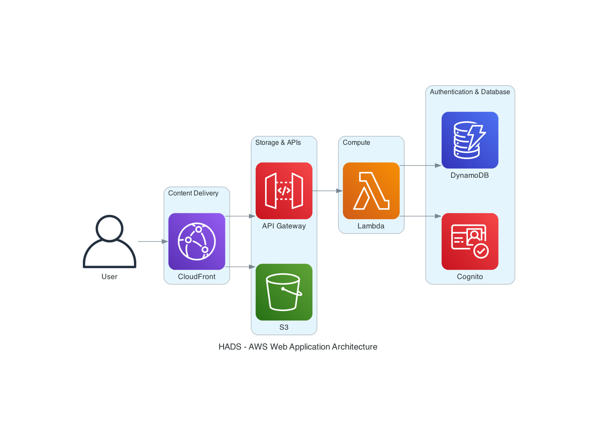
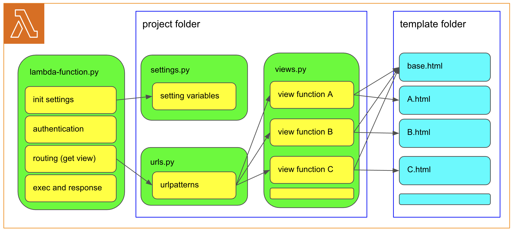

# HADS

## Overview
HADS (h-akira AWS Develop with Serverless) is a framework to develop serverless web applications on AWS.  
Although this framework is a successor to [HAD](https://github.com/h-akira/had), 
there are some cases where it is recommended to continue using HAD because the philosophy is very different.

## Philosophy
- Use SAM
- One Lambda
- Static files are distributed from S3
- Test Locally
- Like Django

## Structure
The AWS configuration for a system built using HADS is shown below. 
Only Lambda and API Gateway are created directly by HADS. 
Although S3 is not created, 
it is possible to synchronize static files using HADS commands.
Other resources are created separately or added to SAM's template.yaml by developper.
  
The Lambda program structure is shown below. 
It is similar to Django, with urls.py, views.py, and template at its core. 
The same Lambda is called from API Gateway regardless of the path. 
When the handler is executed, the view function is passed by the routing function after the initial settings and authentication.
The view function is executed in the handler and the result is returned.
  

## 📚 Documentation

**Note: All documentation is written in Japanese.**

Comprehensive documentation is available in the [doc](./doc/README.md) directory.

### 🚀 Getting Started
- [Installation and Setup](./doc/installation.md)
- [Quick Start Guide](./doc/quickstart.md)

### 📖 Basic Guides
- [Project Structure](./doc/project-structure.md)
- [URL Routing](./doc/url-routing.md)
- [Views and Handlers](./doc/views-handlers.md)
- [Template System](./doc/templates.md)

### 🔧 Advanced Features
- [Authentication & Cognito Integration](./doc/authentication.md)
- [Local Development Environment](./doc/local-development.md)
- [Deployment Guide](./doc/deployment.md)

## Usage

Basic development workflow with HADS:

1. **Initialize Project**
```bash
hads-admin.py --init
```

2. **Local Development**
```bash
cd my-project
hads-admin.py admin.json --local-server-run proxy
```

3. **Deploy to AWS**
```bash
hads-admin.py admin.json --build --deploy
```

For detailed usage instructions, please refer to the [documentation](./doc/README.md).

## Sample Projects
The following are sample projects that use HADS:
- [HadsSampleProject](https://github.com/h-akira/HadsSampleProject)
- [ShogiProject](https://github.com/h-akira/ShogiProject) - A comprehensive Shogi game record management system

## Development Schedule
The following features will be added at a later date:
- Generate SAM and other templates
- Enhanced error handling
- Improved documentation
- Additional authentication providers
