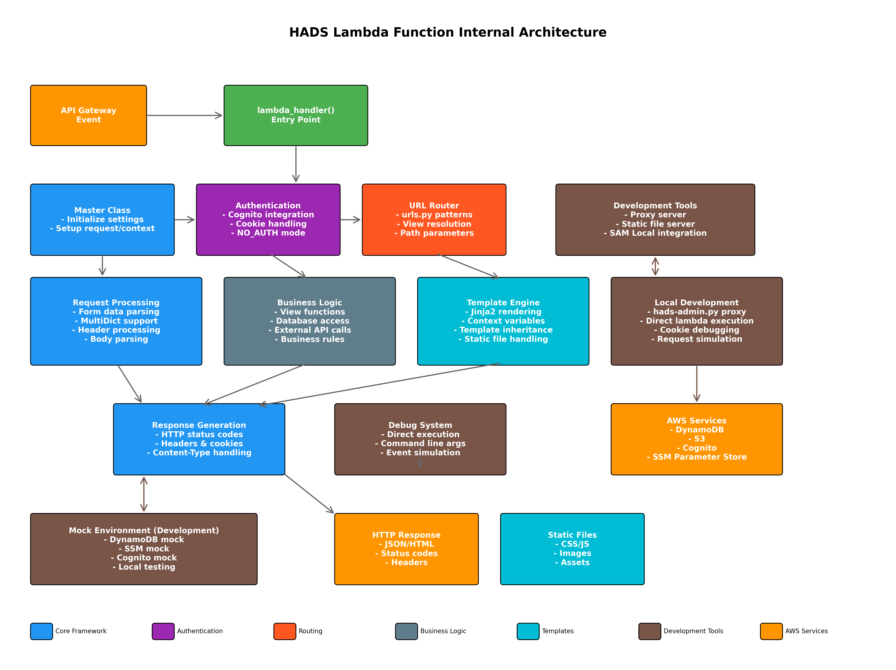

# WAMBDA

## Overview

WAMBDA is a Python framework for developing serverless web applications on AWS Lambda. While developed as a successor to [HAD](https://github.com/h-akira/had), the architectural philosophy is significantly different, and in some cases, continuing with HAD may be recommended depending on the use case.

## Design Philosophy

- **Leverage SAM**: Use AWS Serverless Application Model for infrastructure management
- **Single Lambda**: Process all requests with one Lambda function (Lambdalith approach)
- **S3 Static File Distribution**: Efficiently serve static files from S3
- **Local Development**: Build local development environments equivalent to production
- **Django-like Design**: MVC structure with urls.py, views.py, and templates

## Architecture

### System Configuration

AWS system configuration diagram built with WAMBDA:


- **API Gateway**: Accept HTTP requests and forward to Lambda
- **Lambda Function**: Single function handles all routing and business logic
- **S3**: Serve static files (CSS, JS, images)
- **Other AWS Services**: Additional definitions via SAM templates as needed

### Lambda Internal Structure

Processing flow and component configuration within Lambda function:



1. **Request Reception**: Receive event information from API Gateway
2. **Initialization**: Load settings and process authentication via Master class
3. **Routing**: Determine view functions based on urls.py configuration
4. **View Execution**: Execute business logic through views.py functions
5. **Response Generation**: Generate HTML via template engine and return HTTP response

## 📚 Documentation

**Note: All documentation is written in Japanese.**

Comprehensive documentation is available in the [doc](./doc/README.md) directory.

### 🚀 Getting Started
- [Installation and Setup](./doc/installation.md)
- [Quick Start Guide](./doc/quickstart.md)

### 📖 Basic Guides
- [Project Structure](./doc/project-structure.md)
- [URL Routing](./doc/url-routing.md)
- [Views and Handlers](./doc/views-handlers.md)
- [Template System](./doc/templates.md)

### 🔧 Advanced Features
- [Authentication & Cognito Integration](./doc/authentication.md)
- [Local Development Environment](./doc/local-development.md)
- [Deployment Guide](./doc/deployment.md)

## 🚀 Quick Start

Basic development workflow with WAMBDA:

### 1. Project Initialization
```bash
# Interactive template selection
hads-admin.py init -n my-project

# Create with specified template
hads-admin.py init -n my-project -t SSR001
```

Available templates:
- **SSR001**: Server-side rendering template (with authentication)
- **API001**: API template (for Vue, React, Angular, etc. frontends)

### 2. Start Local Development Environment
```bash
cd my-project

# Start proxy server (recommended: integrates SAM Local + static file server)
hads-admin.py proxy

# Start servers individually
hads-admin.py static          # Static file server (port 8080)
sam local start-api           # SAM Local API server (port 3000)
```

### 3. Testing
```bash
# Test GET request
hads-admin.py get

# Test specific path and method
hads-admin.py get -p /api/users -m POST

# Use custom event file
hads-admin.py get -e custom-event.json
```

### 4. Deploy to AWS
```bash
# Deploy using SAM CLI
sam build
sam deploy

# Sync static files to S3 (AWS CLI)
aws s3 sync static/ s3://your-bucket/static/
```

For detailed usage, please refer to the [documentation](./doc/README.md).

## 📁 Sample Projects

Sample projects using WAMBDA:

### Latest Version (Recommended)
- **[HadsSampleProject2](../HadsSampleProject2/)** - Latest sample with authentication, form handling, and mock functionality
  - AWS Cognito authentication integration
  - Form validation with WTForms
  - AWS service mocking with moto
  - Account management (signup, login, email verification)

### Other Project Examples
- **[HadsSampleProject](../HadsSampleProject/)** - Basic sample (legacy version)
- **[ShogiProject](https://github.com/h-akira/ShogiProject)** - Shogi game record management system (practical example)

## 🛠️ CLI Tool Details

### hads-admin.py Commands

WAMBDA management tools provide a simple and intuitive command-line interface. Everything is controlled by command-line options without depending on configuration files.

#### init - Project Initialization
```bash
hads-admin.py init -n <project-name> [-t <template>]

# Options:
# -n, --name      : Project name (required)
# -t, --template  : Template (SSR001, API001)
```

#### proxy - Start Proxy Server
```bash
hads-admin.py proxy [options]

# Options:
# -p, --proxy-port  : Proxy server port (default: 8000)
# -s, --sam-port    : SAM Local port (default: 3000)
# --static-port     : Static file server port (default: 8080)
# --static-url      : Static file URL prefix (default: /static)
# -d, --static-dir  : Static file directory (default: static)
```

#### static - Start Static File Server
```bash
hads-admin.py static [options]

# Options:
# -p, --port        : Server port (default: 8080)
# --static-url      : URL prefix (default: /static)
# -d, --static-dir  : File directory (default: static)
```

#### get - Lambda Function Testing
```bash
hads-admin.py get [options]

# Options:
# -p, --path         : Path to test (default: /)
# -m, --method       : HTTP method (default: GET)
# -e, --event-file   : Custom event JSON file
# -t, --template     : SAM template file (default: template.yaml)
# -f, --function-name: Lambda function name (default: MainFunction)
```

## 🔧 Development Roadmap

Planned features to be added:
- **Template Generation**: Automatic generation of SAM templates and other configuration files
- **Enhanced Error Handling**: Provide more detailed error information
- **Documentation Improvements**: More detailed usage examples and best practices
- **Additional Authentication Providers**: Support for authentication systems other than Cognito
- **Deployment Support Features**: Integration of automated build and deployment functionality
