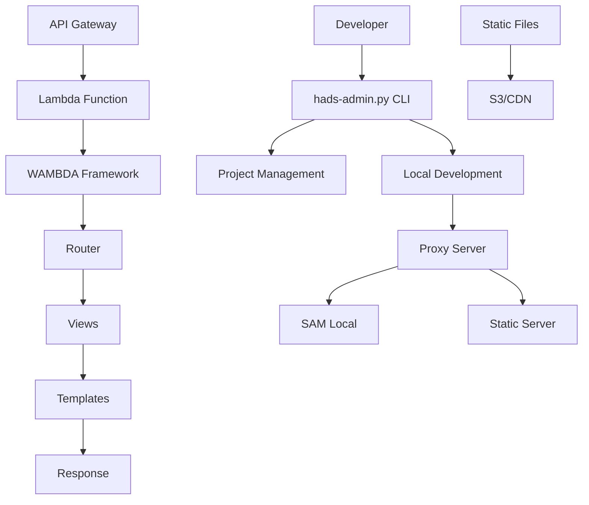

# WAMBDA フレームワーク 基本設計書

## 1. 概要

### 1.1 フレームワークの目的
WAMBDAは、AWS Lambda上で動作するモダンなWebアプリケーションフレームワークです。以下の特徴を持ちます：

- **サーバーレス**: AWS Lambdaで動作し、インフラストラクチャの管理が不要
- **統合CLI**: hads-admin.py によるプロジェクト管理とローカル開発
- **Django風の設計**: Djangoライクなルーティングとビューシステム
- **統合開発環境**: プロキシサーバーによる統合開発体験
- **モッキング対応**: motoを使用したAWSサービスのローカルモック

### 1.2 アーキテクチャ概要



### 1.3 主要コンポーネント

#### フレームワーク本体

1. **Handler** (`handler.py`)
   - AWS Lambdaからのイベントを処理する中核クラス  
   - Master、Request、MultiDict クラスによるリクエスト・レスポンス管理

2. **Router** (`urls.py`)
   - URLパターンマッチングとビューへのディスパッチ
   - Django風のURL設定システム

3. **Authentication** (`authenticate.py`) 
   - 認証機能のユーティリティ関数
   - login、signup、verify などの認証操作

4. **Shortcuts** (`shortcuts.py`)
   - テンプレートレンダリング、リダイレクトなどのユーティリティ関数
   - デコレータによる認証制御

#### 開発ツール

5. **CLI Tool** (`bin/hads-admin.py`)
   - プロジェクト初期化、サーバー起動、テスト実行
   - argparseベースのモダンなコマンドライン interface

6. **Local Server** (`local_server.py`) 
   - 統合プロキシサーバー機能
   - 静的ファイル配信サーバー

## 2. ディレクトリ構造

### 2.1 フレームワーク構造
```
hads/
├── lib/hads/           # フレームワーク本体
│   ├── __init__.py
│   ├── handler.py      # メインハンドラー
│   ├── urls.py         # URLルーティング
│   ├── authenticate.py # 認証システム
│   ├── shortcuts.py    # ユーティリティ関数
│   ├── local_server.py # ローカル開発サーバー
│   └── init_option.py  # プロジェクト初期化
├── bin/                # コマンドラインツール
├── setup.py            # パッケージ設定
└── requirements.txt    # 依存関係
```

### 2.2 アプリケーション構造
```
project/
├── template.yaml       # AWS SAM テンプレート
├── requirements.txt    # 依存関係
├── Lambda/             # Lambda関数コード
│   ├── lambda_function.py  # エントリーポイント
│   ├── project/        # アプリケーション設定
│   │   ├── settings.py # 設定ファイル
│   │   ├── urls.py     # URLパターン
│   │   └── views.py    # ビュー関数
│   └── templates/      # テンプレートファイル
└── static/             # 静的ファイル
```

## 3. 技術スタック

### 3.1 AWS サービス
- **AWS Lambda**: アプリケーション実行環境
- **API Gateway**: HTTPリクエストのルーティング
- **Amazon Cognito**: ユーザー認証・認可
- **AWS Systems Manager Parameter Store**: 設定値の管理

### 3.2 Python ライブラリ
- **Jinja2**: テンプレートエンジン
- **PyJWT**: JWT トークンの処理
- **requests**: HTTP クライアント
- **boto3**: AWS SDK

## 4. リクエスト処理フロー

### 4.1 基本フロー
1. API Gateway がリクエストを受信
2. Lambda関数 (`lambda_handler`) が起動
3. `Master` クラスがリクエストを解析
4. 認証システムがトークンを検証
5. `Router` がURLパターンをマッチング
6. 対応する `View` 関数を実行
7. テンプレートをレンダリングしてレスポンスを生成
8. API Gateway経由でクライアントに返却

### 4.2 認証フロー（詳細は別章で説明）
1. 未認証ユーザーはCognitoログインページにリダイレクト
2. 認証成功後、元のページに認証コード付きでリダイレクト
3. hadsが任意のパスで認証コードを検出し、トークンに交換
4. トークンをCookieに保存し、元のページを表示
5. 以降のリクエストでトークンを検証

## 5. 開発モデル

### 5.1 MVC パターン
- **Model**: 現在は明示的なORMは提供されず、boto3で直接AWS サービスにアクセス
- **View**: ビュー関数でビジネスロジックを実装
- **Controller**: `Master` クラスと `Router` がコントローラーの役割

### 5.2 設定ベース開発
- `settings.py` で各種設定を管理
- 環境別設定（ローカル、本番）の自動切り替え
- AWS Parameter Store による機密情報の管理 