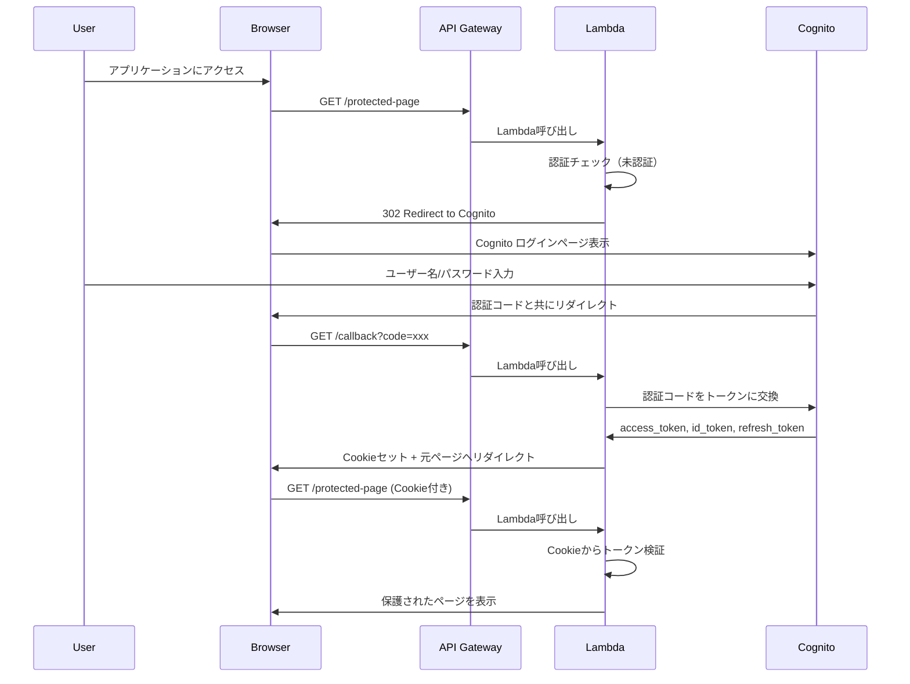
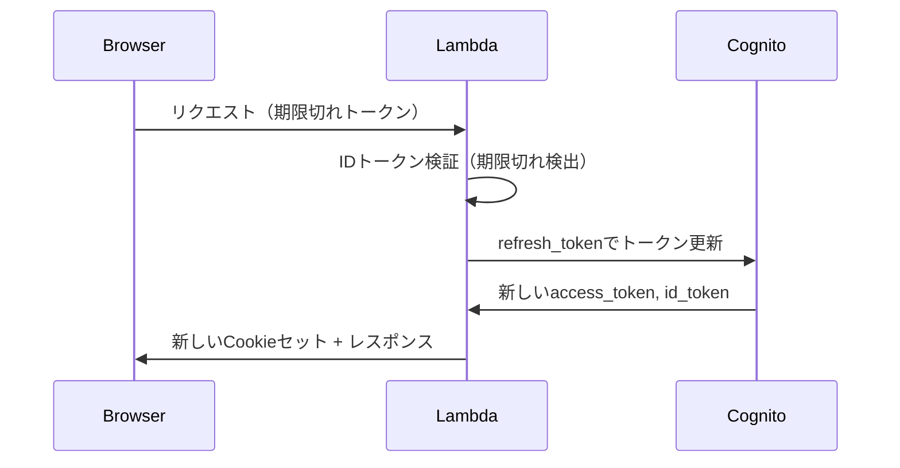

# hads フレームワーク 認証システム設計書

## 1. 認証システム概要

### 1.1 認証アーキテクチャ
hadsの認証システムは、Amazon Cognitoをベースとしたトークンベース認証を採用しています。

### 1.2 主要コンポーネント
- **Cognito クラス**: Cognitoとの統合を担当
- **ManagedAuthPage クラス**: 認証ページのURL生成
- **@login_required デコレータ**: ビューレベルでの認証制御

## 2. 認証フロー

### 2.1 初回ログインフロー



### 2.2 トークン更新フロー



## 3. 認証コンポーネント詳細

### 3.1 Cognito クラス

```python
class Cognito:
    def __init__(self, domain, user_pool_id, client_id, client_secret, region):
        # Cognito設定の初期化
        
    def set_auth_by_code(self, master):
        # 認証コードからトークンを取得
        
    def set_auth_by_cookie(self, master):
        # Cookieからトークンを検証・更新
        
    def add_set_cookie_to_header(self, master, response):
        # レスポンスにCookieヘッダーを追加
        
    def sign_out(self, master):
        # ユーザーサインアウト処理
```

#### 主要メソッド

1. **`set_auth_by_code(master)`**
   - クエリパラメータの`code`を取得
   - 認証コードをトークンに交換
   - `master.request`に認証情報を設定

2. **`set_auth_by_cookie(master)`**
   - Cookieからトークンを抽出
   - IDトークンの有効性を検証
   - 期限切れの場合はrefresh_tokenで更新

3. **`add_set_cookie_to_header(master, response)`**
   - 認証トークンをHTTP-only Cookieとして設定
   - Secure属性によりHTTPS必須

### 3.2 ManagedAuthPage クラス

```python
class ManagedAuthPage:
    def __init__(self, scope, login_redirect_uri):
        # 認証ページの設定
        
    def get_login_url(master):
        # ログインURLの生成
        
    def get_signup_url(master):
        # サインアップURLの生成
```

### 3.3 Request クラスの認証属性

```python
class Request:
    def __init__(self, event, context):
        # 認証関連の属性
        self.auth = False           # 認証状態
        self.username = None        # ユーザー名
        self.set_cookie = False     # Cookie設定フラグ
        self.clean_cookie = False   # Cookie削除フラグ
        self.access_token = None    # アクセストークン
        self.id_token = None        # IDトークン
        self.refresh_token = None   # リフレッシュトークン
        self.decode_token = None    # デコードされたトークン
```

## 4. セキュリティ考慮事項

### 4.1 トークンセキュリティ
- **HTTP-only Cookie**: XSS攻撃からトークンを保護
- **Secure Cookie**: HTTPS通信でのみCookieを送信
- **JWTトークン検証**: 署名検証により改ざんを防止

### 4.2 セッション管理
- **自動トークン更新**: 期限切れ前に自動でトークンを更新
- **グローバルサインアウト**: Cognito側でのセッション無効化
- **Cookie有効期限**: ブラウザ側でのセッション管理

### 4.3 秘密情報管理
- **AWS Parameter Store**: Cognito設定値の暗号化保存
- **環境分離**: ローカル/本番環境での設定分離

## 5. 実装例

### 5.1 設定ファイル (settings.py)

```python
import boto3
from hads.authenticate import Cognito, ManagedAuthPage

# Parameter Storeからの設定取得
ssm = boto3.client('ssm')

COGNITO = Cognito(
    domain=ssm.get_parameter(Name="/app/cognito/domain")["Parameter"]["Value"],
    user_pool_id=ssm.get_parameter(Name="/app/cognito/user_pool_id")["Parameter"]["Value"],
    client_id=ssm.get_parameter(Name="/app/cognito/client_id")["Parameter"]["Value"],
    client_secret=ssm.get_parameter(Name="/app/cognito/client_secret")["Parameter"]["Value"],
    region="ap-northeast-1"
)

AUTH_PAGE = ManagedAuthPage(
    scope="aws.cognito.signin.user.admin email openid phone",
    login_redirect_uri=ssm.get_parameter(Name="/app/redirect_uri")["Parameter"]["Value"],
    local_login_redirect_uri="http://localhost:3000"
)
```

### 5.2 Lambda関数での認証処理

```python
def lambda_handler(event, context):
    master = Master(event, context)
    
    # 認証処理
    master.settings.COGNITO.set_auth_by_code(master)
    master.settings.COGNITO.set_auth_by_cookie(master)
    
    # ルーティング処理
    view, kwargs = master.router.path2view(master.request.path)
    response = view(master, **kwargs)
    
    # Cookieヘッダー追加
    master.settings.COGNITO.add_set_cookie_to_header(master, response)
    
    return response
```

### 5.3 認証が必要なビュー

```python
from hads.shortcuts import login_required, render

@login_required
def protected_view(master):
    context = {
        'username': master.request.username,
        'user_data': master.request.decode_token
    }
    return render(master, 'protected.html', context)
```

### 5.4 ログアウト処理

```python
def logout_view(master):
    master.settings.COGNITO.sign_out(master)
    return redirect(master, 'home')
```

## 6. トラブルシューティング

### 6.1 よくある問題

1. **トークン期限切れエラー**
   - refresh_tokenによる自動更新が機能しているか確認
   - Parameter Store の設定値が正しいか確認

2. **認証ループ**
   - redirect_uriが正しく設定されているか確認
   - Cognitoアプリクライアントの設定を確認

3. **Cookie が設定されない**
   - HTTPS通信になっているか確認（本番環境）
   - Domain設定が適切か確認

### 6.2 ログとデバッグ
- `master.logger`を使用した詳細ログ出力
- AWS CloudWatch Logsでの認証フロー追跡 