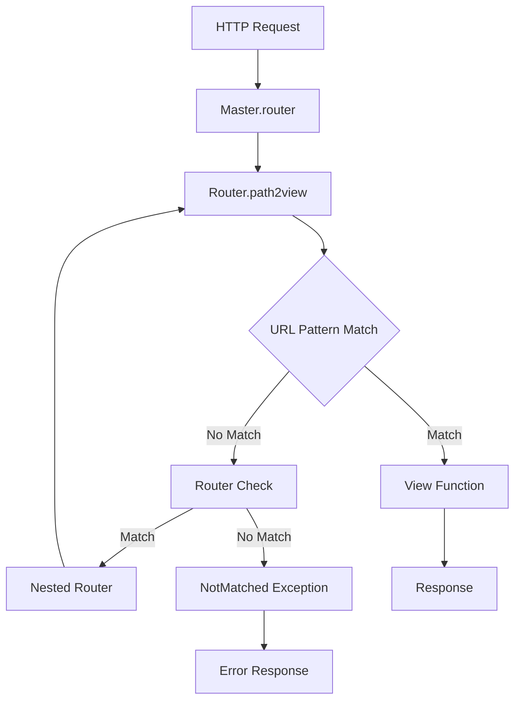
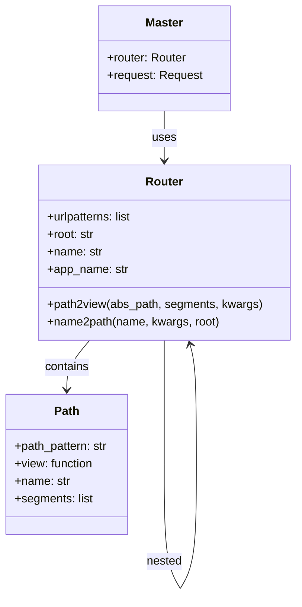

# hads フレームワーク ルーティングシステム設計書

## 1. ルーティングシステム概要

### 1.1 設計思想
hadsのルーティングシステムは、Djangoの URL 設定に影響を受けており、宣言的なURL パターンマッチングを提供します。

### 1.2 主要コンポーネント
- **Router クラス**: URL パターンのマッチングとビューの解決
- **Path クラス**: 単一のURL パターンの定義
- **URL 逆引き**: 名前からURL パスを生成する機能

## 2. アーキテクチャ

### 2.1 URL処理フロー



### 2.2 コンポーネント関係図



## 3. URL パターン定義

### 3.1 Path クラス

```python
class Path:
    def __init__(self, path_pattern: str, view, name=None):
        """
        Args:
            path_pattern: URLパスパターン（例: 'users/{user_id}'）
            view: パスに対応するビュー関数
            name: パスの名前（リバースルックアップに使用）
        """
```

#### パターン構文
- **静的セグメント**: `"users"` → `/users`
- **動的セグメント**: `"users/{user_id}"` → `/users/123`
- **ネストパス**: `"api/v1/users/{user_id}/posts/{post_id}"`

#### 例

```python
from hads.urls import Path

urlpatterns = [
    Path("", index_view, name="home"),                    # /
    Path("about", about_view, name="about"),              # /about
    Path("users/{user_id}", user_detail, name="user"),    # /users/123
    Path("posts/{post_id}/edit", edit_post, name="edit")  # /posts/456/edit
]
```

### 3.2 Router クラス（ネストルーティング）

```python
class Router:
    def __init__(self, root="", urls_str="project.urls", name=None):
        """
        Args:
            root: ルートパス
            urls_str: URLパターンを含むモジュールのインポートパス
            name: ルーターの名前
        """
```

#### ネストルーティング例

```python
# プロジェクトのメインurls.py
urlpatterns = [
    Path("", home_view, name="home"),
    Router("api", "api.urls", name="api"),
    Router("admin", "admin.urls", name="admin")
]

# api/urls.py
urlpatterns = [
    Path("users", api_users, name="users"),
    Path("users/{user_id}", api_user_detail, name="user_detail")
]
```

この場合、以下のURLパターンが生成されます：
- `/` → `home_view`
- `/api/users` → `api_users`
- `/api/users/123` → `api_user_detail` (user_id=123)

## 4. URL マッチング処理

### 4.1 パスセグメント解析

```python
def _abs_path2segments(self, abs_path):
    """絶対パスをセグメントのリストに変換"""
    # "/" → []
    # "/users" → ["users"]
    # "/users/123" → ["users", "123"]
```

### 4.2 パターンマッチング

```python
def _matching_chercker(self, segments, pattern_segments, mode, kwargs={}):
    """パスセグメントがパターンに一致するかチェック"""
    # segments: ["users", "123"]
    # pattern_segments: ["users", "{user_id}"]
    # → True, {"user_id": "123"}
```

### 4.3 マッチング優先順位
1. **Path パターン**: 直接的なURL パターンマッチング
2. **Router パターン**: ネストされたルーターでのマッチング

## 5. URL逆引き（リバースルックアップ）

### 5.1 名前空間システム

```python
# URL名前空間の例
Router("api", "api.urls", name="api")

# api/urls.py
app_name = "v1"
urlpatterns = [
    Path("users/{user_id}", user_detail, name="user")
]

# 逆引き時
master.router.name2path("api:v1:user", {"user_id": 123})
# → "api/users/123"
```

### 5.2 shortcuts モジュールでの利用

```python
from hads.shortcuts import reverse, redirect

def my_view(master):
    # URL生成
    user_url = reverse(master, "api:user", user_id=123)
    
    # リダイレクト
    return redirect(master, "home")
```

### 5.3 テンプレートでの利用

```html
<!-- Jinja2テンプレート内 -->
<a href="{{ reverse('api:user', user_id=123) }}">ユーザー詳細</a>

```

## 6. 実装例

### 6.1 基本的なURL設定

```python
# project/urls.py
from hads.urls import Path, Router
from .views import home, about, contact

urlpatterns = [
    Path("", home, name="home"),
    Path("about", about, name="about"),
    Path("contact", contact, name="contact"),
    Router("blog", "blog.urls", name="blog"),
    Router("api/v1", "api.urls", name="api")
]
```

### 6.2 アプリケーション固有のURL設定

```python
# blog/urls.py
from hads.urls import Path
from .views import blog_list, blog_detail, blog_create

app_name = "blog"

urlpatterns = [
    Path("", blog_list, name="list"),
    Path("create", blog_create, name="create"),
    Path("{slug}", blog_detail, name="detail"),
]
```

### 6.3 ビュー関数での利用

```python
# blog/views.py
from hads.shortcuts import render, redirect, reverse

def blog_create(master):
    if master.request.method == "POST":
        # ブログ作成処理
        blog_id = create_blog(master.request.body)
        return redirect(master, "blog:detail", slug=blog_id)
    
    return render(master, "blog/create.html")

def blog_detail(master, slug):
    context = {
        'blog': get_blog(slug),
        'edit_url': reverse(master, "blog:edit", slug=slug)
    }
    return render(master, "blog/detail.html", context)
```

## 7. エラーハンドリング

### 7.1 例外クラス

```python
class NotMatched(Exception):
    """URLパターンが一致しなかった場合に発生する例外"""
    pass

class KwargsRemain(Exception):
    """URL生成時に使用されなかったキーワード引数がある場合に発生する例外"""
    pass
```

### 7.2 エラー処理フロー

```python
# lambda_function.py での例外ハンドリング
try:
    view, kwargs = master.router.path2view(master.request.path)
    response = view(master, **kwargs)
except NotMatched:
    # 404 Not Found
    response = error_404(master)
except Exception as e:
    # 500 Internal Server Error
    response = error_500(master, e)
```

## 8. パフォーマンス考慮事項

### 8.1 URL マッチング最適化
- **パターン順序**: より具体的なパターンを先に配置
- **セグメント数チェック**: 不要なマッチング処理を早期終了

### 8.2 Router キャッシュ
- **モジュールインポート**: `importlib.import_module` による動的インポート
- **パターンコンパイル**: 初期化時にパターンを解析してキャッシュ

## 9. ベストプラクティス

### 9.1 URL設計指針
- **RESTful設計**: リソース指向のURL構造
- **階層的構造**: 論理的なグループ化でのRouter利用
- **名前付け規則**: 一貫性のある名前空間設計

### 9.2 セキュリティ考慮事項
- **パラメータ検証**: ビュー内でのパラメータ妥当性確認
- **権限チェック**: 適切なデコレータによる認可制御

```python
from hads.shortcuts import login_required

@login_required
def admin_view(master, user_id):
    # user_idの妥当性チェック
    if not is_valid_user_id(user_id):
        return redirect(master, "error")
    
    # 権限チェック
    if not master.request.username == user_id:
        return redirect(master, "forbidden")
    
    return render(master, "admin.html")
``` 