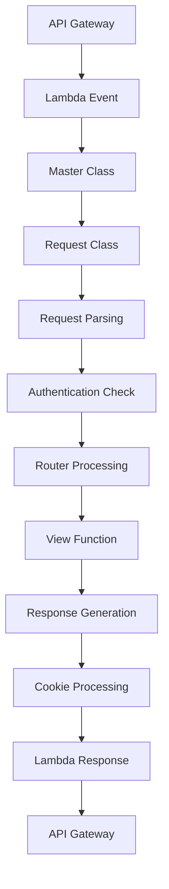

# hads フレームワーク リクエスト・レスポンス処理設計書

## 1. リクエスト・レスポンス処理概要

### 1.1 処理フロー
hadsフレームワークでは、AWS Lambda の event/context から HTTP リクエストを抽象化し、ビュー関数で処理した結果をAWS Lambda の response 形式に変換します。

### 1.2 主要コンポーネント
- **Master クラス**: リクエスト処理の中心となるクラス
- **Request クラス**: HTTP リクエストを表すクラス
- **shortcuts モジュール**: レスポンス生成のヘルパー関数

## 2. リクエスト処理アーキテクチャ

### 2.1 リクエスト処理フロー



### 2.2 Master クラス

```python
class Master:
    def __init__(self, event, context):
        self.event = event              # AWS Lambda イベント
        self.context = context          # AWS Lambda コンテキスト
        self.settings = importlib.import_module('project.settings')
        self.router = Router()
        self.request = Request(event, context)
        self.logger = logging.getLogger()
        self.local = self._determine_local_env()
```

#### 主要属性
- **event**: AWS Lambda の生イベントオブジェクト
- **context**: AWS Lambda のコンテキスト情報
- **settings**: アプリケーション設定（`project.settings`）
- **router**: URL ルーティング処理
- **request**: 抽象化されたHTTPリクエスト
- **logger**: ログ出力用
- **local**: ローカル環境かどうかの判定

## 3. Request クラス詳細

### 3.1 リクエスト属性

```python
class Request:
    def __init__(self, event, context):
        # HTTP基本情報
        self.method = event['requestContext']["httpMethod"]  # GET, POST, etc.
        self.path = event['path']                            # URL パス
        self.body = self._parse_body(event)                  # リクエストボディ
        
        # 認証関連
        self.auth = False               # 認証状態
        self.username = None            # ユーザー名
        self.access_token = None        # アクセストークン
        self.id_token = None           # IDトークン
        self.refresh_token = None      # リフレッシュトークン
        self.decode_token = None       # デコードされたトークン
        
        # Cookie制御
        self.set_cookie = False        # Cookie設定フラグ
        self.clean_cookie = False      # Cookie削除フラグ
```

### 3.2 リクエストボディ解析

```python
def _set_parsed_body(self, event):
    """リクエストボディを解析"""
    if event["requestContext"]["httpMethod"] == "POST" and 'body' in event:
        self.body = urllib.parse.parse_qs(event['body'] or '')
        # 単一値のパラメータを簡略化
        for key, value in self.body.items():
            if len(value) == 1:
                self.body[key] = value[0]
    else:
        self.body = None
```

#### 例
```python
# POSTデータ: "name=John&age=30&hobbies=reading&hobbies=coding"
# 解析結果:
{
    'name': 'John',        # 単一値は文字列に
    'age': '30',           # 単一値は文字列に
    'hobbies': ['reading', 'coding']  # 複数値は配列のまま
}
```

## 4. レスポンス処理

### 4.1 レスポンス形式

AWS Lambda + API Gateway で使用するレスポンス形式：

```python
{
    "statusCode": 200,
    "headers": {
        "Content-Type": "text/html; charset=UTF-8"
    },
    "body": "<html>...</html>",
    "isBase64Encoded": False,
    "multiValueHeaders": {
        "Set-Cookie": ["cookie1=value1", "cookie2=value2"]
    }
}
```

### 4.2 レスポンス生成関数

#### 基本レスポンス生成

```python
def gen_response(master, body, content_type="text/html; charset=UTF-8", code=200, isBase64Encoded=None):
    """基本的なレスポンス生成"""
    response = {
        "statusCode": code,
        "headers": {
            "Content-Type": content_type
        },
        "body": body
    }
    if isBase64Encoded is not None:
        response["isBase64Encoded"] = isBase64Encoded
    return response
```

#### HTMLレンダリング

```python
def render(master, template_file, context={}, content_type="text/html; charset=UTF-8", code=200):
    """Jinja2テンプレートをレンダリング"""
    import jinja2
    
    # テンプレート環境の設定
    env = jinja2.Environment(
        loader=jinja2.FileSystemLoader(master.settings.TEMPLATE_DIR),
    )
    
    # グローバル関数の登録
    env.globals['static'] = static
    env.globals['reverse'] = reverse
    env.globals['get_login_url'] = get_login_url
    env.globals['get_signup_url'] = get_signup_url
    
    # テンプレートレンダリング
    template = env.get_template(template_file)
    if "master" not in context.keys():
        context["master"] = master
    
    return gen_response(master, template.render(**context), content_type, code)
```

#### JSONレスポンス

```python
def json_response(master, body, code=200):
    """JSON形式のレスポンス生成"""
    import json
    return gen_response(
        master, 
        json.dumps(body), 
        "application/json; charset=UTF-8", 
        code
    )
```

#### リダイレクト

```python
def redirect(master, app_name, **kwargs):
    """指定されたURLパターンにリダイレクト"""
    return {
        "statusCode": 302,
        "headers": {
            "Location": reverse(master, app_name, **kwargs)
        }
    }
```

## 5. テンプレートシステム

### 5.1 Jinja2統合

```python
# テンプレート内で使用可能なグローバル関数
env.globals['static'] = static          # 静的ファイルURL生成
env.globals['reverse'] = reverse        # URL逆引き
env.globals['get_login_url'] = get_login_url    # ログインURL
env.globals['get_signup_url'] = get_signup_url  # サインアップURL
```

### 5.2 テンプレート例

```html
<!DOCTYPE html>
<html>
<head>
    <title>{{ title }}</title>
    <link rel="stylesheet" href="{{ static('css/style.css') }}">
</head>
<body>
    <nav>
        
            <span>Hello, {{ master.request.username }}!</span>
            <a href="{{ reverse('logout') }}">ログアウト</a>
        
            <a href="{{ get_login_url(master) }}">ログイン</a>
        
    </nav>
    
    <main>
        <h1>{{ title }}</h1>
        {{ content }}
    </main>
</body>
</html>
```

## 6. 静的ファイル処理

### 6.1 静的ファイルURL生成

```python
def static(master, file_path):
    """静的ファイルのURLを生成"""
    STATIC_URL = master.settings.STATIC_URL
    if STATIC_URL.startswith("/"):
        STATIC_URL = STATIC_URL[1:]
        
    if master.local:
        MAPPING_PATH = master.settings.MAPPING_PATH_LOCAL
    else:
        MAPPING_PATH = master.settings.MAPPING_PATH
        
    if MAPPING_PATH.startswith("/"):
        MAPPING_PATH = MAPPING_PATH[1:]
        
    return os.path.join("/", MAPPING_PATH, STATIC_URL, file_path)
```

### 6.2 ローカル開発での静的ファイル配信

```python
# local_server.py
def run_static_server(static_url, static_dir, port=8080):
    """静的ファイル専用サーバー"""
    
def run_proxy_server(static_url, port=8000, sam_port=3000, static_port=8080):
    """リバースプロキシサーバー"""
    # 静的ファイルリクエスト → static_port
    # その他のリクエスト → sam_port
```

## 7. エラーハンドリング

### 7.1 エラーレスポンス生成

```python
def error_render(master, error_message=None):
    """エラーページの生成"""
    if master.settings.DEBUG:
        # デバッグモード: 詳細なエラー情報を表示
        error_html = """
        <h1>Error</h1>
        <h3>Error Message</h3>
        {error_message}
        <h3>event</h3>
        {event}
        <h3>Context</h3>
        {context}
        """
        return gen_response(
            master, 
            error_html.format(
                error_message=error_message, 
                event=master.event, 
                context=master.context
            ), 
            "text/html; charset=UTF-8", 
            200
        )
    else:
        # 本番モード: 簡潔なエラーメッセージ
        error_html = """
        <h1>Error</h1>
        <p>Sorry, an error occurred.</p>
        <p>Please try again later, or contact the administrator.</p>
        """
        return gen_response(master, error_html, "text/html; charset=UTF-8", 500)
```

### 7.2 Lambda関数でのエラー処理

```python
def lambda_handler(event, context):
    master = Master(event, context)
    
    try:
        # 認証処理
        master.settings.COGNITO.set_auth_by_code(master)
        master.settings.COGNITO.set_auth_by_cookie(master)
        
        # ルーティング
        view, kwargs = master.router.path2view(master.request.path)
        response = view(master, **kwargs)
        
        # Cookie処理
        master.settings.COGNITO.add_set_cookie_to_header(master, response)
        
        return response
        
    except Exception as e:
        if master.request.path == "/favicon.ico":
            master.logger.warning("favicon.ico not found")
        else:
            master.logger.exception(e)
        
        import traceback
        return error_render(master, traceback.format_exc())
```

## 8. 環境別設定

### 8.1 ローカル/本番環境の判定

```python
def _set_local(self):
    """ローカル開発環境かどうかを判定"""
    AWS_SAM_LOCAL = os.getenv("AWS_SAM_LOCAL")
    if AWS_SAM_LOCAL is None:
        # 環境変数がない場合はadmin.jsonの存在で判断
        if os.path.isfile(os.path.join(self.settings.BASE_DIR, '../admin.json')):
            self.local = True
        else:
            self.local = False
    else:
        if AWS_SAM_LOCAL == "true":
            self.local = True
        elif AWS_SAM_LOCAL == "false":
            self.local = False
        else:
            raise ValueError("AWS_SAM_LOCALは'true'または'false'である必要があります")
```

### 8.2 設定値の使い分け

```python
# settings.py
MAPPING_PATH = "stage-01"  # 本番環境のAPIステージ名
MAPPING_PATH_LOCAL = ""    # ローカル環境では空文字

# URL生成時の自動切り替え
if master.local:
    MAPPING_PATH = master.settings.MAPPING_PATH_LOCAL
else:
    MAPPING_PATH = master.settings.MAPPING_PATH
```

## 9. パフォーマンス考慮事項

### 9.1 レスポンス最適化
- **レスポンスサイズ**: 必要最小限のデータのみ返却
- **キャッシュヘッダー**: 適切なキャッシュ制御
- **圧縮**: API Gateway での自動gzip圧縮

### 9.2 ログ最適化
- **構造化ログ**: JSON形式でのログ出力
- **ログレベル制御**: 環境別のログレベル設定
- **機密情報のマスキング**: ログ出力時の情報保護 