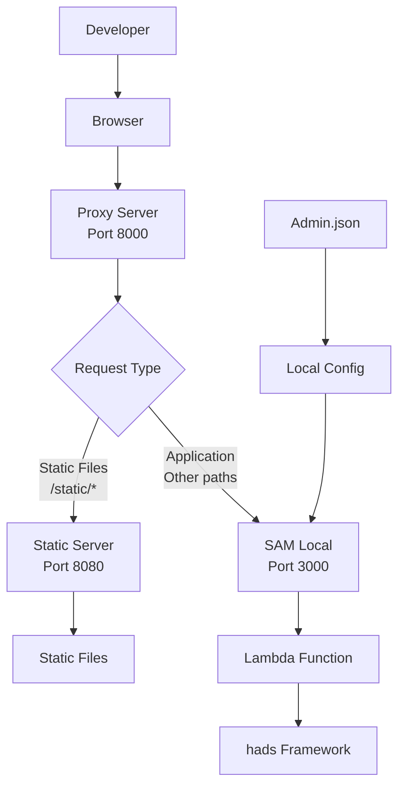

# hads フレームワーク 開発環境設計書

## 1. 開発環境概要

### 1.1 開発環境構成
hadsフレームワークは、AWS SAM (Serverless Application Model) をベースとしたローカル開発環境を提供します。

### 1.2 開発環境の特徴
- **SAM Local統合**: AWS Lambda環境をローカルで再現
- **静的ファイル配信**: 専用サーバーによる効率的な静的ファイル処理
- **プロキシサーバー**: アプリケーションと静的ファイルの統合アクセス
- **環境自動判定**: ローカル/本番環境の自動切り替え

## 2. 開発環境アーキテクチャ

### 2.1 ローカル開発構成図



### 2.2 サーバー構成

| サーバー | ポート | 役割 | 説明 |
|---------|--------|------|------|
| プロキシサーバー | 8000 | 統合エントリーポイント | リクエストを適切なサーバーに振り分け |
| SAM Local | 3000 | アプリケーション | Lambda関数とAPI Gatewayを模擬 |
| 静的ファイルサーバー | 8080 | 静的ファイル配信 | CSS, JS, 画像などの配信 |

## 3. ローカルサーバー詳細

### 3.1 静的ファイルサーバー

```python
def run_static_server(static_url, static_dir, port=8080):
    """
    静的ファイルを提供するサーバーを実行
    
    Args:
        static_url: 静的ファイルのURLパス（例: '/static'）
        static_dir: 静的ファイルのディレクトリパス
        port: サーバーのポート番号
    """
    class MyHTTPRequestHandler(http.server.SimpleHTTPRequestHandler):
        def translate_path(self, path):
            if path.startswith(static_url):
                return os.path.join(os.getcwd(), path[1:])
            else:
                return None
                
        def do_GET(self):
            path = self.translate_path(self.path)
            if path and os.path.exists(path) and os.path.isfile(path):
                super().do_GET()
            else:
                self.send_error(404, "File Not Found")
```

#### 特徴
- **パスマッピング**: `/static/*` リクエストを実際のファイルシステムパスにマッピング
- **セキュリティ**: 指定されたディレクトリ外へのアクセスを制限
- **エラーハンドリング**: 存在しないファイルへの適切な404レスポンス

### 3.2 プロキシサーバー

```python
def run_proxy_server(static_url, port=8000, sam_port=3000, static_port=8080):
    """
    リバースプロキシサーバーを実行
    
    Args:
        static_url: 静的ファイルのURLパス
        port: プロキシサーバーのポート
        sam_port: SAM Localサーバーのポート
        static_port: 静的ファイルサーバーのポート
    """
    class ReverseProxyHandler(http.server.BaseHTTPRequestHandler):
        def do_GET(self):
            parsed_url = urlparse(self.path)
            if parsed_url.path.startswith(static_url):
                target_url = f'http://localhost:{static_port}{self.path}'
            else:
                target_url = f'http://localhost:{sam_port}{self.path}'
            
            try:
                with urllib.request.urlopen(target_url) as response:
                    self.send_response(response.status)
                    self.send_header('Content-type', 
                                   response.headers.get('Content-type', 'text/html'))
                    self.end_headers()
                    self.wfile.write(response.read())
            except urllib.error.URLError as e:
                self.send_error(500, str(e.reason))
```

#### ルーティング規則
- **静的ファイル**: `/static/*` → 静的ファイルサーバー (8080)
- **アプリケーション**: その他すべて → SAM Local (3000)

## 4. 環境判定システム

### 4.1 ローカル環境判定ロジック

```python
def _set_local(self):
    """ローカル開発環境かどうかを判定"""
    AWS_SAM_LOCAL = os.getenv("AWS_SAM_LOCAL")
    
    if AWS_SAM_LOCAL is None:
        # 環境変数がない場合はadmin.jsonの存在で判断
        admin_json_path = os.path.join(self.settings.BASE_DIR, '../admin.json')
        self.local = os.path.isfile(admin_json_path)
    else:
        if AWS_SAM_LOCAL == "true":
            self.local = True
        elif AWS_SAM_LOCAL == "false":
            self.local = False
        else:
            raise ValueError("AWS_SAM_LOCALは'true'または'false'である必要があります")
```

### 4.2 判定基準

| 判定方法 | 条件 | 結果 |
|---------|------|------|
| 環境変数 | `AWS_SAM_LOCAL=true` | ローカル環境 |
| 環境変数 | `AWS_SAM_LOCAL=false` | 本番環境 |
| ファイル存在 | `admin.json` ファイルが存在 | ローカル環境 |
| デフォルト | 上記すべて該当しない | 本番環境 |

## 5. 設定管理

### 5.1 admin.json 設定ファイル

```json
{
    "region": "ap-northeast-1",
    "profile": "default"
}
```

#### 用途
- **AWS認証情報**: ローカル開発時のAWSプロファイル指定
- **リージョン設定**: AWS サービスの利用リージョン
- **環境判定**: ファイルの存在によるローカル環境判定

### 5.2 環境別設定の切り替え

```python
# settings.py での環境別設定
if os.path.exists(os.path.join(BASE_DIR, "../admin.json")):
    # ローカル環境の設定
    import json
    with open(os.path.join(BASE_DIR, "../admin.json")) as f:
        admin = json.load(f)
    
    kwargs = {}
    try:
        kwargs["region_name"] = admin["region"]
    except KeyError:
        pass
    try:
        kwargs["profile_name"] = admin["profile"]
    except KeyError:
        pass
    
    session = boto3.Session(**kwargs)
    ssm = session.client('ssm')
else:
    # 本番環境の設定
    ssm = boto3.client('ssm')
```

### 5.3 URL/パス設定の環境対応

```python
# settings.py
MAPPING_PATH = "stage-01"  # 本番: API Gatewayのステージ名
MAPPING_PATH_LOCAL = ""    # ローカル: 空文字列（ステージなし）

# 使用時の自動切り替え
def reverse(master, app_name, **kwargs):
    path = master.router.name2path(app_name, kwargs)
    
    if master.local:
        MAPPING_PATH = master.settings.MAPPING_PATH_LOCAL
    else:
        MAPPING_PATH = master.settings.MAPPING_PATH
        
    if MAPPING_PATH.startswith("/"):
        MAPPING_PATH = MAPPING_PATH[1:]
        
    return os.path.join("/", MAPPING_PATH, path)
```

## 6. 開発ワークフロー

### 6.1 プロジェクト初期化

```bash
# 1. SAMテンプレートの作成
sam init --runtime python3.12 --name my-hads-app

# 2. hads依存関係の追加
echo "hads" >> requirements.txt

# 3. プロジェクト構造の作成
mkdir -p Lambda/project
mkdir -p Lambda/templates
mkdir -p static

# 4. 設定ファイルの作成
cp admin.json.example admin.json
```

### 6.2 ローカル開発サーバー起動

```bash
# 1. SAM Local の起動
sam local start-api --port 3000

# 2. 静的ファイルサーバーの起動 (別ターミナル)
python -c "from hads.local_server import run_static_server; run_static_server('/static', 'static', 8080)"

# 3. プロキシサーバーの起動 (別ターミナル)
python -c "from hads.local_server import run_proxy_server; run_proxy_server('/static', 8000, 3000, 8080)"
```

### 6.3 開発時のURL構成

```
ローカル開発環境:
http://localhost:8000/                 → アプリケーションホーム
http://localhost:8000/api/users        → API エンドポイント
http://localhost:8000/static/css/style.css → 静的ファイル

本番環境:
https://api.example.com/stage-01/      → アプリケーションホーム
https://api.example.com/stage-01/api/users → API エンドポイント
https://api.example.com/stage-01/static/css/style.css → 静的ファイル
```

## 7. デバッグとログ

### 7.1 ローカル開発でのログ出力

```python
# lambda_function.py
def lambda_handler(event, context):
    master = Master(event, context)
    master.logger.info(f"Request: {master.request.method} {master.request.path}")
    
    if master.local:
        master.logger.info("ローカル開発環境で実行中")
    
    try:
        # アプリケーション処理
        pass
    except Exception as e:
        master.logger.exception("エラーが発生しました")
```

### 7.2 エラー表示の環境対応

```python
def error_render(master, error_message=None):
    if master.settings.DEBUG:
        # 開発環境: 詳細なエラー情報を表示
        error_html = f"""
        <h1>Error</h1>
        <h3>Error Message</h3>
        <pre>{error_message}</pre>
        <h3>Event</h3>
        <pre>{master.event}</pre>
        """
        return gen_response(master, error_html, "text/html; charset=UTF-8", 200)
    else:
        # 本番環境: 簡潔なエラーメッセージ
        return gen_response(master, "<h1>Internal Server Error</h1>", 
                          "text/html; charset=UTF-8", 500)
```

## 8. 本番デプロイ

### 8.1 SAM デプロイ設定

```yaml
# samconfig.toml
version = 0.1
[default]
[default.deploy]
[default.deploy.parameters]
stack_name = "my-hads-app"
s3_bucket = "my-deployment-bucket"
s3_prefix = "my-hads-app"
region = "ap-northeast-1"
capabilities = "CAPABILITY_IAM"
parameter_overrides = "ParameterKey=Environment,ParameterValue=production"
```

### 8.2 環境変数の設定

```yaml
# template.yaml
Environment:
  Variables:
    AWS_SAM_LOCAL: "false"  # 本番環境であることを明示
```

### 8.3 静的ファイルの配信

本番環境では、静的ファイルは以下の方法で配信：

1. **API Gateway統合**: Lambdaで静的ファイルも処理
2. **S3 + CloudFront**: 別途CDNを構築
3. **カスタムドメイン**: API Gatewayのカスタムドメイン機能

## 9. パフォーマンス最適化

### 9.1 ローカル開発の最適化

```python
# 開発時の高速化設定
if master.local:
    # テンプレートキャッシュを無効化（開発時の変更を即座に反映）
    env = jinja2.Environment(
        loader=jinja2.FileSystemLoader(master.settings.TEMPLATE_DIR),
        cache_size=0
    )
```

### 9.2 静的ファイルキャッシュ

```python
# 開発環境での適切なキャッシュヘッダー設定
def do_GET(self):
    # ... ファイル処理 ...
    
    # 開発環境ではキャッシュを無効化
    self.send_header('Cache-Control', 'no-cache, no-store, must-revalidate')
    self.send_header('Pragma', 'no-cache')
    self.send_header('Expires', '0')
```

## 10. トラブルシューティング

### 10.1 よくある問題

1. **ポート競合**
   - 他のプロセスがポート使用中
   - 解決: `lsof -i :8000` でプロセス確認

2. **静的ファイル404エラー**
   - パスマッピングの設定ミス
   - 解決: `STATIC_URL` 設定の確認

3. **認証エラー**
   - admin.json の設定不備
   - 解決: AWS認証情報の確認

### 10.2 ログ確認手順

```bash
# SAM Local のログ
sam local start-api --port 3000 --log-file sam.log

# Lambda関数のログ
tail -f sam.log | grep "lambda_handler"

# プロキシサーバーのログ
# コンソール出力を確認
``` 