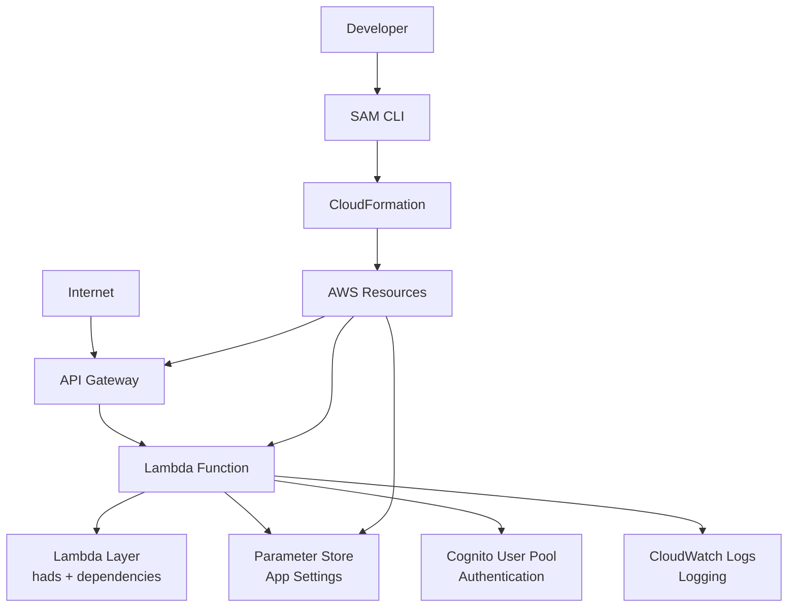

# hads フレームワーク デプロイメント設計書

## 1. デプロイメント概要

### 1.1 デプロイメント戦略
hadsフレームワークは、AWS SAM (Serverless Application Model) を使用したInfrastructure as Code (IaC) によるデプロイメントを採用しています。

### 1.2 主要コンポーネント
- **AWS Lambda**: アプリケーション実行環境
- **API Gateway**: HTTPエンドポイント
- **Lambda Layer**: 共通ライブラリの配布
- **IAM Role**: 実行権限の管理
- **Systems Manager Parameter Store**: 設定値の管理

## 2. インフラアーキテクチャ

### 2.1 AWS サービス構成図



### 2.2 SAM テンプレート構造

```yaml
AWSTemplateFormatVersion: '2010-09-09'
Transform: AWS::Serverless-2016-10-31
Description: hads Application Template

Globals:
  Function:
    Timeout: 30
    Tracing: Active
    MemorySize: 512
    
Resources:
  # API Gateway
  MainAPIGateway:
    Type: AWS::Serverless::Api
    
  # Lambda Function  
  MainFunction:
    Type: AWS::Serverless::Function
    
  # Lambda Layer
  MainLayer:
    Type: AWS::Serverless::LayerVersion
    
  # IAM Role
  LambdaExecutionRole:
    Type: AWS::IAM::Role
```

## 3. Lambda 関数設定

### 3.1 Lambda 関数定義

```yaml
MainFunction:
  Type: AWS::Serverless::Function
  Properties:
    FunctionName: !Sub '${AWS::StackName}-main'
    CodeUri: Lambda/
    Handler: lambda_function.lambda_handler
    Runtime: python3.12
    Layers:
      - !Ref MainLayer
    Role: !GetAtt LambdaExecutionRole.Arn
    Environment:
      Variables:
        AWS_SAM_LOCAL: "false"
    Events:
      ApiRoot:
        Type: Api
        Properties:
          Path: '/'
          Method: ANY
          RestApiId: !Ref MainAPIGateway
      ApiProxy:
        Type: Api
        Properties:
          Path: '/{proxy+}'
          Method: ANY
          RestApiId: !Ref MainAPIGateway
```

#### 主要設定項目
- **Runtime**: Python 3.12
- **Memory**: 512MB（調整可能）
- **Timeout**: 30秒
- **Tracing**: X-Ray有効
- **Events**: すべてのHTTPリクエストを受信

### 3.2 Lambda Layer設定

```yaml
MainLayer:
  Type: AWS::Serverless::LayerVersion
  Properties:
    LayerName: !Sub '${AWS::StackName}-layer'
    Description: hads framework and dependencies
    ContentUri: Layer/
    CompatibleRuntimes:
      - python3.12
    RetentionPolicy: Retain
  Metadata:
    BuildMethod: python3.12
```

#### Layer構造
```
Layer/
├── python/
│   ├── hads/           # hadsフレームワーク
│   ├── jinja2/         # テンプレートエンジン
│   ├── jwt/            # JWT処理
│   ├── requests/       # HTTPクライアント
│   └── ...             # その他の依存関係
└── requirements.txt
```

## 4. API Gateway設定

### 4.1 API Gateway定義

```yaml
MainAPIGateway:
  Type: AWS::Serverless::Api
  Properties:
    Name: !Sub '${AWS::StackName}-api'
    StageName: !Ref Stage
    TracingEnabled: true
    Cors:
      AllowMethods: "'GET,POST,PUT,DELETE,OPTIONS'"
      AllowHeaders: "'Content-Type,X-Amz-Date,Authorization,X-Api-Key,X-Amz-Security-Token'"
      AllowOrigin: "'*'"
    GatewayResponses:
      DEFAULT_4XX:
        ResponseParameters:
          Headers:
            Access-Control-Allow-Origin: "'*'"
      DEFAULT_5XX:
        ResponseParameters:
          Headers:
            Access-Control-Allow-Origin: "'*'"
```

#### 主要機能
- **CORS対応**: クロスオリジンリクエストのサポート
- **X-Ray統合**: リクエストトレーシング
- **カスタムドメイン**: 本番環境での独自ドメイン設定

### 4.2 ステージ設定

```yaml
Parameters:
  Stage:
    Type: String
    Default: dev
    AllowedValues:
      - dev
      - staging
      - prod
    Description: Deployment stage
```

## 5. IAM権限設定

### 5.1 Lambda実行ロール

```yaml
LambdaExecutionRole:
  Type: AWS::IAM::Role
  Properties:
    RoleName: !Sub '${AWS::StackName}-lambda-role'
    AssumeRolePolicyDocument:
      Version: '2012-10-17'
      Statement:
        - Effect: Allow
          Principal:
            Service: lambda.amazonaws.com
          Action: sts:AssumeRole
    ManagedPolicyArns:
      - arn:aws:iam::aws:policy/service-role/AWSLambdaBasicExecutionRole
      - arn:aws:iam::aws:policy/AWSXRayDaemonWriteAccess
    Policies:
      - PolicyName: ParameterStoreAccess
        PolicyDocument:
          Version: '2012-10-17'
          Statement:
            - Effect: Allow
              Action:
                - ssm:GetParameter
                - ssm:GetParameters
              Resource: !Sub 'arn:aws:ssm:${AWS::Region}:${AWS::AccountId}:parameter/${AWS::StackName}/*'
      - PolicyName: CognitoAccess
        PolicyDocument:
          Version: '2012-10-17'
          Statement:
            - Effect: Allow
              Action:
                - cognito-idp:*
              Resource: '*'
```

### 5.2 必要権限一覧

| サービス | 権限 | 用途 |
|---------|------|------|
| CloudWatch Logs | Write | ログ出力 |
| X-Ray | Write | トレーシング |
| Systems Manager | GetParameter | 設定値取得 |
| Cognito | Full | 認証処理 |

## 6. 設定管理

### 6.1 Parameter Store設定

```yaml
# Parameters for application configuration
CognitoDomainParameter:
  Type: AWS::SSM::Parameter
  Properties:
    Name: !Sub '/${AWS::StackName}/cognito/domain'
    Type: String
    Value: !Ref CognitoDomain
    Description: Cognito domain URL

CognitoUserPoolIdParameter:
  Type: AWS::SSM::Parameter
  Properties:
    Name: !Sub '/${AWS::StackName}/cognito/user_pool_id'
    Type: String
    Value: !Ref CognitoUserPoolId
    Description: Cognito User Pool ID

RedirectUriParameter:
  Type: AWS::SSM::Parameter
  Properties:
    Name: !Sub '/${AWS::StackName}/redirect_uri'
    Type: String
    Value: !Sub 'https://${MainAPIGateway}.execute-api.${AWS::Region}.amazonaws.com/${Stage}/'
    Description: Application redirect URI
```

### 6.2 環境別設定

```python
# settings.py での環境別Parameter Store参照
import boto3
import os

def get_parameter_name(param_name):
    """環境に応じたパラメータ名を生成"""
    stack_name = os.environ.get('STACK_NAME', 'hads-app')
    return f'/{stack_name}/{param_name}'

ssm = boto3.client('ssm')

COGNITO = Cognito(
    domain=ssm.get_parameter(Name=get_parameter_name('cognito/domain'))["Parameter"]["Value"],
    user_pool_id=ssm.get_parameter(Name=get_parameter_name('cognito/user_pool_id'))["Parameter"]["Value"],
    client_id=ssm.get_parameter(Name=get_parameter_name('cognito/client_id'))["Parameter"]["Value"],
    client_secret=ssm.get_parameter(Name=get_parameter_name('cognito/client_secret'))["Parameter"]["Value"],
    region=os.environ.get('AWS_REGION', 'ap-northeast-1')
)
```

## 7. デプロイメントワークフロー

### 7.1 デプロイメント手順

```bash
# 1. ビルド
sam build

# 2. デプロイ（初回）
sam deploy --guided

# 3. デプロイ（2回目以降）
sam deploy

# 4. スタック削除
sam delete
```

### 7.2 CI/CDパイプライン

```yaml
# buildspec.yml (AWS CodeBuild)
version: 0.2
phases:
  install:
    runtime-versions:
      python: 3.12
    commands:
      - pip install aws-sam-cli
  pre_build:
    commands:
      - echo Logging in to Amazon ECR...
  build:
    commands:
      - echo Build started on `date`
      - sam build
      - sam deploy --no-confirm-changeset --no-fail-on-empty-changeset
  post_build:
    commands:
      - echo Build completed on `date`
```

### 7.3 環境別デプロイ

```bash
# 開発環境
sam deploy --config-env dev

# ステージング環境
sam deploy --config-env staging

# 本番環境
sam deploy --config-env prod
```

```toml
# samconfig.toml
version = 0.1

[dev]
[dev.deploy.parameters]
stack_name = "hads-app-dev"
s3_bucket = "deployment-bucket-dev"
s3_prefix = "hads-app-dev"
region = "ap-northeast-1"
parameter_overrides = "Stage=dev"

[prod]
[prod.deploy.parameters]
stack_name = "hads-app-prod"
s3_bucket = "deployment-bucket-prod"
s3_prefix = "hads-app-prod"
region = "ap-northeast-1"
parameter_overrides = "Stage=prod"
```

## 8. モニタリングとログ

### 8.1 CloudWatch統合

```yaml
# Lambda関数でのログ設定
LoggingConfig:
  LogFormat: JSON
  ApplicationLogLevel: INFO
  SystemLogLevel: WARN
  LogGroup: !Sub '/aws/lambda/${AWS::StackName}-main'
```

### 8.2 アラーム設定

```yaml
ErrorAlarm:
  Type: AWS::CloudWatch::Alarm
  Properties:
    AlarmName: !Sub '${AWS::StackName}-lambda-errors'
    AlarmDescription: Lambda function errors
    MetricName: Errors
    Namespace: AWS/Lambda
    Statistic: Sum
    Period: 300
    EvaluationPeriods: 2
    Threshold: 5
    ComparisonOperator: GreaterThanOrEqualToThreshold
    Dimensions:
      - Name: FunctionName
        Value: !Ref MainFunction

DurationAlarm:
  Type: AWS::CloudWatch::Alarm
  Properties:
    AlarmName: !Sub '${AWS::StackName}-lambda-duration'
    AlarmDescription: Lambda function duration
    MetricName: Duration
    Namespace: AWS/Lambda
    Statistic: Average
    Period: 300
    EvaluationPeriods: 2
    Threshold: 25000  # 25秒
    ComparisonOperator: GreaterThanOrEqualToThreshold
    Dimensions:
      - Name: FunctionName
        Value: !Ref MainFunction
```

### 8.3 X-Ray トレーシング

```python
# Lambda関数でのX-Ray統合
from aws_xray_sdk.core import xray_recorder
from aws_xray_sdk.core import patch_all

# AWS SDKの自動トレーシング
patch_all()

@xray_recorder.capture('lambda_handler')
def lambda_handler(event, context):
    with xray_recorder.in_subsegment('initialize_master'):
        master = Master(event, context)
    
    with xray_recorder.in_subsegment('routing'):
        view, kwargs = master.router.path2view(master.request.path)
    
    with xray_recorder.in_subsegment('view_execution'):
        response = view(master, **kwargs)
    
    return response
```

## 9. セキュリティ考慮事項

### 9.1 WAF設定

```yaml
# API Gateway用WAF設定
WebACL:
  Type: AWS::WAFv2::WebACL
  Properties:
    Name: !Sub '${AWS::StackName}-waf'
    Scope: REGIONAL
    DefaultAction:
      Allow: {}
    Rules:
      - Name: RateLimitRule
        Priority: 1
        Statement:
          RateBasedStatement:
            Limit: 2000
            AggregateKeyType: IP
        Action:
          Block: {}
        VisibilityConfig:
          SampledRequestsEnabled: true
          CloudWatchMetricsEnabled: true
          MetricName: RateLimitRule

WebACLAssociation:
  Type: AWS::WAFv2::WebACLAssociation
  Properties:
    ResourceArn: !Sub '${MainAPIGateway}/stages/${Stage}'
    WebACLArn: !GetAtt WebACL.Arn
```

### 9.2 秘密情報の管理

```yaml
# Secrets Manager での秘密情報管理
CognitoClientSecret:
  Type: AWS::SecretsManager::Secret
  Properties:
    Name: !Sub '${AWS::StackName}/cognito/client-secret'
    Description: Cognito app client secret
    SecretString: !Ref CognitoClientSecretValue
```

## 10. パフォーマンス最適化

### 10.1 Lambda設定の最適化

```yaml
# メモリサイズの調整
MemorySize: 512  # 128-10240MB

# タイムアウトの調整  
Timeout: 30      # 最大15分

# 同時実行数の制御
ReservedConcurrencyLimit: 100

# プロビジョニングされた同時実行
ProvisionedConcurrencyConfig:
  ProvisionedConcurrencyExecutions: 10
```

### 10.2 コールドスタート対策

```python
# Lambda関数での最適化
import boto3

# グローバル変数でのクライアント初期化
ssm_client = boto3.client('ssm')
cognito_client = boto3.client('cognito-idp')

def lambda_handler(event, context):
    # 初期化処理の最小化
    master = Master(event, context)
    # ...
```

## 11. 災害復旧

### 11.1 バックアップ戦略

- **コード**: GitHubでのソース管理
- **設定**: Parameter Store + CloudFormationテンプレート
- **ログ**: CloudWatch Logsの自動保持

### 11.2 リージョン間レプリケーション

```yaml
# マルチリージョンデプロイ設定
Mappings:
  RegionMap:
    us-east-1:
      S3Bucket: "deployment-bucket-us-east-1"
    ap-northeast-1:
      S3Bucket: "deployment-bucket-ap-northeast-1"

Resources:
  ReplicationRole:
    Type: AWS::IAM::Role
    Properties:
      # クロスリージョンレプリケーション用ロール設定
```

## 12. コスト最適化

### 12.1 料金モデル

| サービス | 課金単位 | 最適化のポイント |
|---------|---------|----------------|
| Lambda | リクエスト数 + 実行時間 | メモリサイズとタイムアウトの調整 |
| API Gateway | APIコール数 | 不要なリクエストの削減 |
| Parameter Store | API呼び出し数 | 設定値のキャッシュ |

### 12.2 コスト監視

```yaml
# CloudWatch Billing Alarm
CostAlarm:
  Type: AWS::CloudWatch::Alarm
  Properties:
    AlarmName: !Sub '${AWS::StackName}-cost-alarm'
    AlarmDescription: Monthly cost alarm
    MetricName: EstimatedCharges
    Namespace: AWS/Billing
    Statistic: Maximum
    Period: 86400
    EvaluationPeriods: 1
    Threshold: 100  # $100
    ComparisonOperator: GreaterThanThreshold
    Dimensions:
      - Name: Currency
        Value: USD
``` 