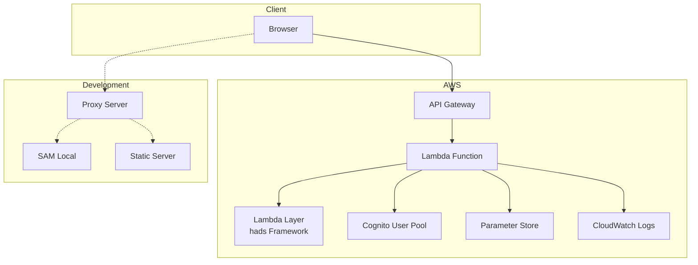
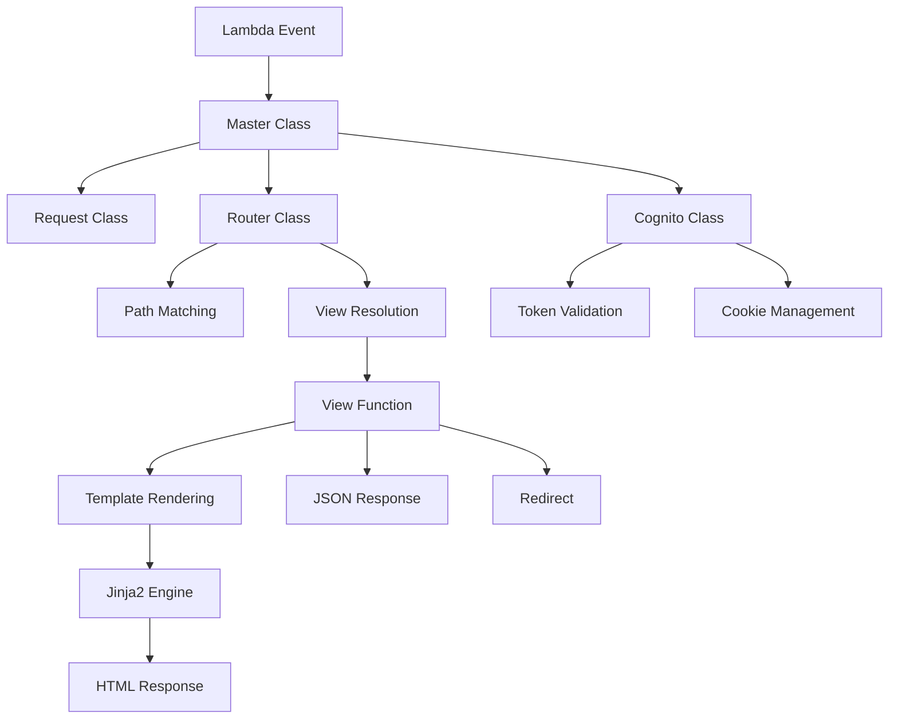

# hads フレームワーク 設計書

## 概要

hadsは、AWS Lambda上で動作するサーバーレスWebアプリケーションフレームワークです。この設計書は、hadsフレームワークの設計思想、アーキテクチャ、実装詳細を包括的に説明し、同じものを再構築できるレベルの詳細な情報を提供します。

## 目次

### [01. 基本設計書](01_overview.md)
- フレームワークの概要と目的
- 主要コンポーネントの説明
- アーキテクチャ概要
- 技術スタック
- ディレクトリ構造

### [02. 認証システム設計書](02_authentication.md)
- Amazon Cognito統合認証システム
- 認証フローの詳細図解
- トークンベース認証の実装
- セキュリティ考慮事項
- 実装例とトラブルシューティング

### [03. ルーティングシステム設計書](03_routing.md)
- Django風URLルーティング
- Path/Routerクラスの設計
- URL逆引き機能
- ネストルーティング
- エラーハンドリング

### [04. リクエスト・レスポンス処理設計書](04_request_response.md)
- Master/Requestクラスの設計
- レスポンス生成システム
- テンプレートエンジン統合
- 静的ファイル処理
- エラーハンドリング

### [05. 開発環境設計書](05_development_environment.md)
- ローカル開発環境の構築
- SAM Local統合
- 静的ファイルサーバー
- プロキシサーバー
- 環境判定システム

### [06. デプロイメント設計書](06_deployment.md)
- AWS SAMによるIaC
- Lambda/API Gateway設定
- IAM権限管理
- モニタリング・ログ
- セキュリティ・パフォーマンス最適化

## 設計原則

### 1. サーバーレス・ファースト
- AWS Lambdaでの実行を前提とした設計
- コールドスタート対策
- ステートレス設計

### 2. 開発者体験の向上
- Django風の親しみやすいAPI
- ローカル開発環境の充実
- 設定の自動化

### 3. セキュリティ
- Amazon Cognitoとの深い統合
- HTTP-only Cookieによるトークン保護
- IAM権限の最小化

### 4. 運用性
- CloudWatch統合ログ
- X-Rayトレーシング
- Infrastructure as Code

## アーキテクチャ図

### システム全体概要



### フレームワーク内部構造



## 実装サンプル

hadsフレームワークを使用したサンプルアプリケーションは、[HadsSampleProject](../../HadsSampleProject/) で確認できます。

### 基本的な使用例

```python
# lambda_function.py
from hads.handler import Master

def lambda_handler(event, context):
    master = Master(event, context)
    master.settings.COGNITO.set_auth_by_code(master)
    master.settings.COGNITO.set_auth_by_cookie(master)
    
    view, kwargs = master.router.path2view(master.request.path)
    response = view(master, **kwargs)
    
    master.settings.COGNITO.add_set_cookie_to_header(master, response)
    return response

# views.py
from hads.shortcuts import render, login_required

@login_required
def protected_view(master):
    context = {'username': master.request.username}
    return render(master, 'protected.html', context)

# urls.py
from hads.urls import Path
from .views import protected_view

urlpatterns = [
    Path("protected", protected_view, name="protected"),
]
```

## 学習リソース

### 前提知識
- AWS Lambda の基本
- API Gateway の基本
- Python の基本（特にデコレータ、クラス）
- AWS SAM の基本

### 関連ドキュメント
- [AWS Lambda Developer Guide](https://docs.aws.amazon.com/lambda/)
- [AWS SAM Developer Guide](https://docs.aws.amazon.com/serverless-application-model/)
- [Amazon Cognito Developer Guide](https://docs.aws.amazon.com/cognito/)

## 貢献方法

hadsフレームワークの改善に貢献したい場合は、以下の手順を参考にしてください：

1. この設計書を読んで、フレームワークの全体像を理解する
2. [HadsSampleProject](../../HadsSampleProject/) で実際の使用方法を確認する
3. 改善提案や不具合報告を行う
4. コード変更時は対応する設計書も更新する

## よくある質問

### Q: hadsとDjangoの違いは何ですか？
A: hadsはAWS Lambda専用に設計されたサーバーレスフレームワークです。Djangoの使いやすいAPIを参考にしつつ、Lambda環境での制約（ステートレス、コールドスタート等）に最適化されています。

### Q: 他のサーバーレスフレームワークとの違いは？
A: hadsは特にAmazon Cognitoとの統合認証に強みがあり、Django風のルーティングシステムを提供します。また、ローカル開発環境の充実により、開発体験の向上を重視しています。

### Q: 本番環境での実績はありますか？
A: はい、[HadsSampleProject](../../HadsSampleProject/)が実際の本番運用例です。AWS Lambda + API Gateway環境での安定動作を確認済みです。

---

**注意**: この設計書は、hadsフレームワークの現在の実装に基づいて作成されています。フレームワークの更新に伴い、設計書も随時更新される可能性があります。
