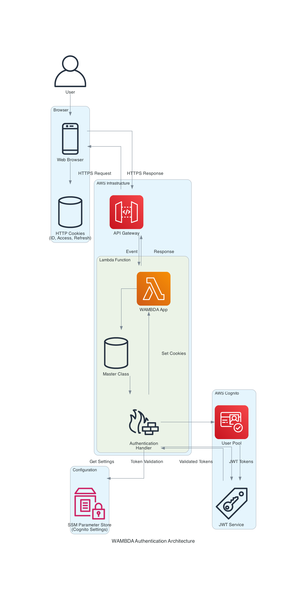
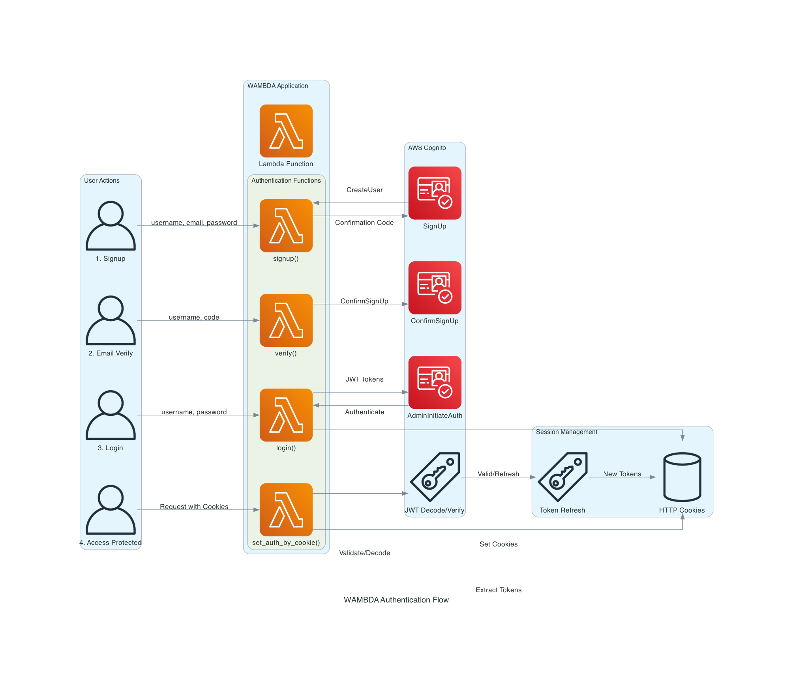

# 認証とCognito統合

WAMBDAはAWS Cognitoとの統合により、包括的で安全な認証システムを提供します。ユーザー登録からログイン、パスワード管理、アカウント削除まで完全にサポートしています。

## 🔐 認証システムの概要

### 認証フロー

```
1. ユーザーがサインアップ
2. メール確認コード送信・検証
3. ログイン（Cognito AdminInitiateAuth）
4. JWTトークン（ID、Access、Refresh）受信
5. トークンをHTTPOnlyCookieに保存
6. 以降のリクエストでトークン自動検証
7. 期限切れ時にRefreshTokenで自動更新
```

### アーキテクチャ図

認証システムの全体構成:



認証フローの詳細:



## ⚙️ 設定

### 1. Cognito User Pool作成

```bash
# User Pool作成
aws cognito-idp create-user-pool \
  --pool-name "wambda-user-pool" \
  --policies '{
    "PasswordPolicy": {
      "MinimumLength": 8,
      "RequireUppercase": true,
      "RequireLowercase": true,
      "RequireNumbers": true,
      "RequireSymbols": false
    }
  }' \
  --auto-verified-attributes email \
  --username-attributes email \
  --region ap-northeast-1

# User Pool Client作成
aws cognito-idp create-user-pool-client \
  --user-pool-id "ap-northeast-1_XXXXXXXXX" \
  --client-name "wambda-app-client" \
  --generate-secret \
  --explicit-auth-flows ADMIN_USER_PASSWORD_AUTH ALLOW_REFRESH_TOKEN_AUTH \
  --region ap-northeast-1
```

### 2. SSM Parameter Store設定

```bash
# 必須パラメータの設定
aws ssm put-parameter \
  --name "/Cognito/user_pool_id" \
  --value "ap-northeast-1_XXXXXXXXX" \
  --type "String"

aws ssm put-parameter \
  --name "/Cognito/client_id" \
  --value "your-client-id" \
  --type "String"

aws ssm put-parameter \
  --name "/Cognito/client_secret" \
  --value "your-client-secret" \
  --type "SecureString"
```

### 3. settings.py設定

```python
# Lambda/project/settings.py
import os

# 認証設定 - SSMパラメータ名の定義
COGNITO_SSM_PARAMS = {
    'USER_POOL_ID': '/Cognito/user_pool_id',
    'CLIENT_ID': '/Cognito/client_id',
    'CLIENT_SECRET': '/Cognito/client_secret'
}
REGION = "ap-northeast-1"

# 認証URL設定（URL名で指定）
LOGIN_URL = "accounts:login"
SIGNUP_URL = "accounts:signup"
VERIFY_URL = "accounts:verify"
LOGOUT_URL = "accounts:logout"

# 開発・テスト設定
NO_AUTH = os.environ.get("WAMBDA_NO_AUTH", "False").lower() == "true"
DENY_SIGNUP = os.environ.get("WAMBDA_DENY_SIGNUP", "False").lower() == "true"
DENY_LOGIN = os.environ.get("WAMBDA_DENY_LOGIN", "False").lower() == "true"
```

## 🚪 認証フローの実装

### 1. Lambda関数の認証処理

```python
# Lambda/lambda_function.py
import sys
import os
sys.path.append(os.path.dirname(__file__))

from wambda.handler import Master
from wambda.authenticate import set_auth_by_cookie, add_set_cookie_to_header

def lambda_handler(event, context):
    master = Master(event, context)
    master.logger.info(f"Request: {master.request.method} {master.request.path}")

    # Cookieから認証情報を取得・検証
    set_auth_by_cookie(master)

    try:
        # URLルーティング
        view, kwargs = master.get_view(master.request.path)
        response = view(master, **kwargs)

        # 認証Cookieをレスポンスに追加
        response = add_set_cookie_to_header(master, response)

        return response

    except Exception as e:
        master.logger.exception(e)
        from wambda.shortcuts import error_render
        import traceback
        return error_render(master, traceback.format_exc())
```

### 2. 認証ビューの実装

```python
# Lambda/accounts/views.py
from wambda.shortcuts import render, redirect
from wambda.authenticate import login, signup, verify, change_password, sign_out
from .forms import LoginForm, SignupForm, VerifyForm, ChangePasswordForm

def login_view(master):
    """ログインビュー"""
    if master.request.method == 'POST':
        form = LoginForm(master.request.get_form_data())
        if form.validate():
            username = form.username.data
            password = form.password.data

            if login(master, username, password):
                return redirect(master, 'home')
            else:
                context = {'form': form, 'error': 'ログインに失敗しました'}
                return render(master, 'accounts/login.html', context)
    else:
        form = LoginForm()
        # クエリパラメータからメッセージを取得
        message_type = master.request.query_params.get('message', '')
        context = {'form': form}

        if message_type == 'verify_success':
            context['message'] = 'メールアドレスの確認が完了しました'
        elif message_type == 'password_reset_success':
            context['message'] = 'パスワードリセットが完了しました'

    return render(master, 'accounts/login.html', context)

def signup_view(master):
    """サインアップビュー"""
    if master.request.method == 'POST':
        form = SignupForm(master.request.get_form_data())
        if form.validate():
            username = form.username.data
            email = form.email.data
            password = form.password.data

            if signup(master, username, email, password):
                return redirect(master, 'accounts:verify', query_params={
                    'username': username,
                    'message': 'signup_success'
                })
            else:
                context = {'form': form, 'error': 'サインアップに失敗しました'}
                return render(master, 'accounts/signup.html', context)
    else:
        form = SignupForm()

    return render(master, 'accounts/signup.html', {'form': form})

def verify_view(master):
    """メール確認ビュー"""
    if master.request.method == 'POST':
        form = VerifyForm(master.request.get_form_data())
        if form.validate():
            username = form.username.data
            code = form.code.data

            if verify(master, username, code):
                return redirect(master, 'accounts:login', query_params={
                    'message': 'verify_success'
                })
            else:
                context = {'form': form, 'error': '確認に失敗しました'}
                return render(master, 'accounts/verify.html', context)
    else:
        form = VerifyForm()
        # クエリパラメータからユーザー名とメッセージを取得
        username = master.request.query_params.get('username', '')
        message_type = master.request.query_params.get('message', '')

        if username:
            form.username.data = username

        context = {'form': form}
        if message_type == 'signup_success':
            context['message'] = 'サインアップが完了しました。確認コードをメールで送信しました。'

    return render(master, 'accounts/verify.html', context)

def logout_view(master):
    """ログアウトビュー"""
    try:
        sign_out(master)
    except Exception as e:
        master.logger.warning(f"Logout warning: {e}")
        # 強制的にCookie削除
        master.request.clean_cookie = True

    return redirect(master, 'home')

def user_profile_view(master):
    """ユーザープロフィールビュー"""
    if not master.request.auth:
        return redirect(master, 'accounts:login')

    context = {
        'username': master.request.username,
        'user_info': master.request.decode_token if hasattr(master.request, 'decode_token') else {}
    }

    # クエリパラメータからメッセージを取得
    message_type = master.request.query_params.get('message', '')
    if message_type == 'password_changed':
        context['message'] = 'パスワードが正常に変更されました'

    return render(master, 'accounts/user_profile.html', context)

def change_password_view(master):
    """パスワード変更ビュー"""
    if not master.request.auth:
        return redirect(master, 'accounts:login')

    if master.request.method == 'POST':
        form = ChangePasswordForm(master.request.get_form_data())
        if form.validate():
            current_password = form.current_password.data
            new_password = form.new_password.data

            if change_password(master, current_password, new_password):
                # パスワード変更成功後はアカウント情報ページにリダイレクト
                return redirect(master, 'accounts:profile', query_params={
                    'message': 'password_changed'
                })
            else:
                context = {'form': form, 'error': 'パスワード変更に失敗しました'}
                return render(master, 'accounts/change_password.html', context)
    else:
        form = ChangePasswordForm()

    return render(master, 'accounts/change_password.html', {'form': form})

def delete_account_view(master):
    """アカウント削除ビュー"""
    if not master.request.auth:
        return redirect(master, 'accounts:login')

    if master.request.method == 'POST':
        form = DeleteAccountForm(master.request.get_form_data())
        if form.validate():
            current_password = form.current_password.data
            username = master.request.username

            # パスワード認証確認
            if login(master, username, current_password):
                # Cognitoからユーザー削除
                import boto3
                from wambda.authenticate import get_cognito_settings

                client = boto3.client('cognito-idp', region_name=master.settings.REGION)
                cognito_settings = get_cognito_settings(master)

                try:
                    client.admin_delete_user(
                        UserPoolId=cognito_settings['USER_POOL_ID'],
                        Username=username
                    )

                    # サインアウト
                    sign_out(master)

                    return redirect(master, 'home', query_params={
                        'message': 'account_deleted'
                    })
                except Exception as e:
                    master.logger.error(f"Account deletion error: {e}")
                    context = {'form': form, 'error': 'アカウント削除中にエラーが発生しました'}
                    return render(master, 'accounts/delete_account.html', context)
            else:
                context = {'form': form, 'error': 'パスワードが正しくありません'}
                return render(master, 'accounts/delete_account.html', context)
    else:
        form = DeleteAccountForm()

    return render(master, 'accounts/delete_account.html', {'form': form})
```

### 3. フォーム定義

```python
# Lambda/accounts/forms.py
from wtforms import Form, StringField, PasswordField, validators

class LoginForm(Form):
    username = StringField('ユーザー名', [validators.DataRequired()])
    password = PasswordField('パスワード', [validators.DataRequired()])

class SignupForm(Form):
    username = StringField('ユーザー名', [
        validators.DataRequired(),
        validators.Length(min=3, max=20)
    ])
    email = StringField('メールアドレス', [
        validators.DataRequired(),
        validators.Email()
    ])
    password = PasswordField('パスワード', [
        validators.DataRequired(),
        validators.Length(min=8)
    ])
    confirm_password = PasswordField('パスワード確認', [
        validators.DataRequired(),
        validators.EqualTo('password', message='パスワードが一致しません')
    ])

class VerifyForm(Form):
    username = StringField('ユーザー名', [validators.DataRequired()])
    code = StringField('確認コード', [validators.DataRequired()])

class ChangePasswordForm(Form):
    current_password = PasswordField('現在のパスワード', [validators.DataRequired()])
    new_password = PasswordField('新しいパスワード', [
        validators.DataRequired(),
        validators.Length(min=8)
    ])
    confirm_password = PasswordField('新しいパスワード確認', [
        validators.DataRequired(),
        validators.EqualTo('new_password', message='パスワードが一致しません')
    ])

class DeleteAccountForm(Form):
    current_password = PasswordField('現在のパスワード', [validators.DataRequired()])
    delete_confirmation = StringField('削除確認', [
        validators.DataRequired(),
        validators.EqualTo('DELETE', message='削除確認のために「DELETE」と入力してください')
    ])
```

## 🔒 アクセス制御

### login_requiredデコレータ

```python
from wambda.shortcuts import login_required

@login_required
def protected_view(master):
    """ログインが必要なページ"""
    context = {
        "title": "保護されたページ",
        "username": master.request.username
    }
    return render(master, "protected.html", context)
```

### カスタム認証デコレータ

```python
def admin_required(func):
    """管理者権限が必要なビューのデコレータ"""
    def wrapper(master, **kwargs):
        if not master.request.auth:
            from wambda.authenticate import get_login_url
            return {
                'statusCode': 302,
                'headers': {
                    'Location': get_login_url(master)
                }
            }

        # Cognitoグループチェック
        if not master.request.decode_token:
            return render(master, "403.html", code=403)

        user_groups = master.request.decode_token.get("cognito:groups", [])
        if "admin" not in user_groups:
            return render(master, "403.html", {
                "error": "管理者権限が必要です"
            }, code=403)

        return func(master, **kwargs)
    return wrapper
```

## 🎨 テンプレート実装

### ベーステンプレート

```html
<!-- templates/base.html -->
<!DOCTYPE html>
<html lang="ja">
<head>
    <meta charset="UTF-8">
    <meta name="viewport" content="width=device-width, initial-scale=1.0">
    <title>WAMBDAアプリ</title>
    <link href="https://cdn.jsdelivr.net/npm/bootstrap@5.1.3/dist/css/bootstrap.min.css" rel="stylesheet">
</head>
<body>
    <nav class="navbar navbar-expand-lg navbar-dark bg-primary">
        <div class="container">
            <a class="navbar-brand" href="{{ reverse(master, 'home') }}">WAMBDAアプリ</a>

            <div class="navbar-nav ms-auto">
                
                    <!-- ログイン中 -->
                    <div class="dropdown">
                        <a class="nav-link dropdown-toggle" href="#" role="button"
                           data-bs-toggle="dropdown">
                            👤 {{ master.request.username }}
                        </a>
                        <ul class="dropdown-menu">
                            <li>
                                <a class="dropdown-item" href="{{ reverse(master, 'accounts:profile') }}">
                                    プロフィール
                                </a>
                            </li>
                            <li>
                                <a class="dropdown-item" href="{{ reverse(master, 'accounts:change_password') }}">
                                    パスワード変更
                                </a>
                            </li>
                            <li><hr class="dropdown-divider"></li>
                            <li>
                                <a class="dropdown-item" href="{{ reverse(master, 'accounts:logout') }}">
                                    ログアウト
                                </a>
                            </li>
                        </ul>
                    </div>
                
                    <!-- 未ログイン -->
                    <a class="nav-link" href="{{ get_login_url(master) }}">ログイン</a>
                    <a class="nav-link" href="{{ get_signup_url(master) }}">サインアップ</a>
                
            </div>
        </div>
    </nav>

    <main class="container mt-4">
        
    </main>

    <script src="https://cdn.jsdelivr.net/npm/bootstrap@5.1.3/dist/js/bootstrap.bundle.min.js"></script>
</body>
</html>
```

### ログインページ

```html
<!-- templates/accounts/login.html -->



<div class="row justify-content-center">
    <div class="col-md-6">
        <div class="card">
            <div class="card-header">
                <h4>ログイン</h4>
            </div>
            <div class="card-body">
                
                    <div class="alert alert-success">{{ message }}</div>
                

                
                    <div class="alert alert-danger">{{ error }}</div>
                

                <form method="post">
                    <div class="mb-3">
                        {{ form.username.label(class="form-label") }}
                        {{ form.username(class="form-control") }}
                        
                            <div class="text-danger">{{ form.username.errors[0] }}</div>
                        
                    </div>

                    <div class="mb-3">
                        {{ form.password.label(class="form-label") }}
                        {{ form.password(class="form-control") }}
                        
                            <div class="text-danger">{{ form.password.errors[0] }}</div>
                        
                    </div>

                    <button type="submit" class="btn btn-primary">ログイン</button>
                </form>
            </div>
            <div class="card-footer">
                <a href="{{ get_signup_url(master) }}">新規登録はこちら</a>
            </div>
        </div>
    </div>
</div>

```

## 🛠️ 高度な機能

### パスワードリセット

WAMBDAは`forgot_password`と`confirm_forgot_password`関数を提供しています：

```python
from wambda.authenticate import forgot_password, confirm_forgot_password

def forgot_password_view(master):
    """パスワードリセット確認コード送信"""
    if master.request.method == 'POST':
        form = ForgotPasswordForm(master.request.get_form_data())
        if form.validate():
            username = form.username.data

            if forgot_password(master, username):
                return redirect(master, 'accounts:reset_password', query_params={
                    'username': username,
                    'message': 'code_sent'
                })
            else:
                context = {'form': form, 'error': 'ユーザーが見つかりません'}
                return render(master, 'accounts/forgot_password.html', context)
    else:
        form = ForgotPasswordForm()

    return render(master, 'accounts/forgot_password.html', {'form': form})

def reset_password_view(master):
    """パスワードリセット実行"""
    if master.request.method == 'POST':
        form = ResetPasswordForm(master.request.get_form_data())
        if form.validate():
            username = form.username.data
            confirmation_code = form.confirmation_code.data
            new_password = form.new_password.data

            if confirm_forgot_password(master, username, confirmation_code, new_password):
                return redirect(master, 'accounts:login', query_params={
                    'message': 'password_reset_success'
                })
            else:
                context = {'form': form, 'error': 'リセットに失敗しました'}
                return render(master, 'accounts/reset_password.html', context)
    else:
        form = ResetPasswordForm()
        # クエリパラメータからユーザー名を設定
        username = master.request.query_params.get('username', '')
        if username:
            form.username.data = username

    return render(master, 'accounts/reset_password.html', {'form': form})
```

### NO_AUTHモード（開発用）

開発時に認証をスキップできるモードです：

```python
# settings.py
NO_AUTH = True  # 開発時のみ

# 使用例
def test_protected_view(master):
    """開発時は誰でもアクセス可能"""
    if master.settings.NO_AUTH:
        # 開発モード：認証スキップ
        master.request.auth = True
        master.request.username = "test_user"
    elif not master.request.auth:
        return redirect(master, 'accounts:login')

    return render(master, 'protected.html')
```

### メンテナンスモード

```python
# settings.py
DENY_LOGIN = True   # ログイン拒否
DENY_SIGNUP = True  # サインアップ拒否

# authenticate.pyで自動的に処理される
from wambda.authenticate import MaintenanceOptionError

try:
    login(master, username, password)
except MaintenanceOptionError:
    # メンテナンス中エラー処理
    pass
```

## 🧪 テストとデバッグ

### 認証状態のデバッグ

```python
def debug_auth_view(master):
    """認証状態のデバッグ（DEBUG=Trueの時のみ）"""
    if not master.settings.DEBUG:
        return render(master, "404.html", code=404)

    auth_info = {
        "auth_status": master.request.auth,
        "username": master.request.username,
        "decode_token": master.request.decode_token,
        "access_token_preview": master.request.access_token[:20] + "..." if master.request.access_token else None
    }

    return render(master, "debug/auth.html", {"auth_info": auth_info})
```

## 📋 ベストプラクティス

### 1. セキュリティ考慮事項

- **HTTPOnly Cookie**: XSS攻撃を防ぐためJavaScriptからアクセス不可
- **Secure Cookie**: HTTPS接続でのみ送信
- **SameSite設定**: CSRF攻撃を防ぐ
- **トークン自動リフレッシュ**: 期限切れ時の自動更新

### 2. エラーハンドリング

```python
def robust_protected_view(master):
    """堅牢な認証チェック付きビュー"""
    try:
        if not master.request.auth:
            return redirect(master, 'accounts:login')

        if not master.request.decode_token:
            master.logger.warning("Invalid token detected")
            master.request.clean_cookie = True
            return redirect(master, 'accounts:login')

        # 正常処理
        return render(master, "protected.html")

    except Exception as e:
        master.logger.error(f"Authentication error: {e}")
        return render(master, "error.html", {"error": "認証エラーが発生しました"})
```

### 3. ログ出力

```python
# 認証イベントのログ出力
if master.request.auth:
    master.logger.info(f"Authenticated access: {master.request.username} -> {master.request.path}")
else:
    master.logger.info(f"Unauthenticated access: {master.request.path}")
```

## 次のステップ

認証システムの実装が完了したら：

- [ローカル開発環境](./local-development.md) - 開発環境での認証テスト
- [デプロイメント](./deployment.md) - 本番環境での認証設定
- [テンプレートシステム](./templates.md) - 認証状態に応じたUI表示

---

[← 前: URLルーティング](./url-routing.md) | [ドキュメント目次に戻る](./README.md) | [次: ローカル開発環境 →](./local-development.md)