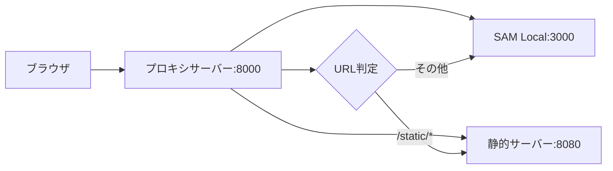

# コマンドラインツール

WAMBDAは強力なコマンドラインツール `wambda-admin.py` を提供し、プロジェクトの作成から開発、テストまでを統合的に管理できます。設定ファイルに依存しない、直感的で使いやすいコマンドライン引数ベースのインターフェースを提供します。

## 🛠️ wambda-admin.py の概要

`wambda-admin.py` はWAMBDAプロジェクトの中心的な管理ツールで、以下の機能を提供します：

- **プロジェクト初期化**: テンプレートベースの新規プロジェクト作成
- **ローカル開発サーバー**: 統合プロキシサーバーと静的ファイル配信
- **テスト機能**: lambda_function.py直接実行によるテスト
- **ヘルプ機能**: 組み込みヘルプとサブコマンド案内

### 基本構文

```bash
# 新しい構文（推奨）
wambda-admin.py <command> [options]

# 利用可能なコマンド
wambda-admin.py init      # プロジェクト初期化
wambda-admin.py proxy     # プロキシサーバー起動
wambda-admin.py static    # 静的ファイルサーバー起動
wambda-admin.py help      # ヘルプ表示
```

## 📋 コマンド詳細仕様

### 1. init - プロジェクト初期化

新しいWAMBDAプロジェクトをテンプレートから作成します。

#### 基本使用法

```bash
# 対話式でプロジェクト作成
wambda-admin.py init -n my-project

# テンプレートを指定して作成
wambda-admin.py init -n my-project -t SSR001
```

#### オプション

| オプション | 短縮 | 説明 | 必須 |
|-----------|------|------|------|
| `--name` | `-n` | プロジェクト名（ディレクトリ名） | ✅ |
| `--template` | `-t` | テンプレート選択（SSR001, API001） | ❌ |

#### 利用可能なテンプレート

| テンプレート | 説明 |
|-------------|------|
| **SSR001** | Server Side Rendering Template - 認証機能付きの完全なWebアプリケーション |
| **API001** | API Template - Vue、React、Angular等のフロントエンド向けAPI |

#### 実行例

```bash
# 対話式選択
$ wambda-admin.py init -n blog-app
Available templates:
  SSR001: Server Side Rendering Template
  API001: API Template (For Vue, React, Angular, etc.)

Please select a template: SSR001

# テンプレート指定
$ wambda-admin.py init -n api-server -t API001
```

#### 生成されるファイル構造

```
my-project/
├── Lambda/
│   ├── lambda_function.py      # Lambda関数エントリーポイント
│   ├── project/               # メインアプリケーション
│   │   ├── settings.py        # 設定ファイル
│   │   ├── urls.py           # URLルーティング
│   │   └── views.py          # ビューハンドラー
│   ├── templates/            # HTMLテンプレート
│   └── requirements.txt      # Python依存関係
├── static/                   # 静的ファイル（CSS、JS、画像）
├── template.yaml            # SAM CloudFormationテンプレート
├── samconfig.toml          # SAM設定ファイル
```

### 2. proxy - プロキシサーバー起動

ローカル開発用の統合プロキシサーバーを起動します。静的ファイルとAPI リクエストを適切に転送する単一エンドポイントを提供します。

#### 基本使用法

```bash
# デフォルト設定でプロキシサーバー起動
wambda-admin.py proxy

# カスタムポート設定
wambda-admin.py proxy -p 9000 -s 3001 --static-port 8081
```

#### オプション

| オプション | 短縮 | 説明 | デフォルト |
|-----------|------|------|-----------|
| `--proxy-port` | `-p` | プロキシサーバーポート | 8000 |
| `--sam-port` | `-s` | SAM Localポート | 3000 |
| `--static-port` |  | 静的ファイルサーバーポート | 8080 |
| `--static-url` |  | 静的ファイルURL プレフィックス | /static |
| `--static-dir` | `-d` | 静的ファイルディレクトリ | static |

#### プロキシ動作



#### 実行例

```bash
# 基本起動
$ wambda-admin.py proxy
Starting proxy server on port 8000
  - Static files (/static*) -> port 8080  
  - API requests -> port 3000

# カスタム設定
$ wambda-admin.py proxy -p 9000 --static-url /assets
Starting proxy server on port 9000
  - Static files (/assets*) -> port 8080
  - API requests -> port 3000
```

### 3. static - 静的ファイルサーバー起動

静的ファイル（CSS、JavaScript、画像など）を配信する専用サーバーを起動します。

#### 基本使用法

```bash
# デフォルト設定で起動
wambda-admin.py static

# カスタム設定で起動  
wambda-admin.py static -p 8081 -d assets --static-url /files
```

#### オプション

| オプション | 短縮 | 説明 | デフォルト |
|-----------|------|------|-----------|
| `--port` | `-p` | サーバーポート | 8080 |
| `--static-url` |  | URL プレフィックス | /static |
| `--static-dir` | `-d` | ファイルディレクトリ | static |

#### 実行例

```bash
# 基本起動
$ wambda-admin.py static
Starting static file server on port 8080
  - Serving files from: /path/to/project/static
  - URL prefix: /static

# カスタム起動
$ wambda-admin.py static -p 9090 -d public --static-url /assets
Starting static file server on port 9090
  - Serving files from: /path/to/project/public  
  - URL prefix: /assets
```

### 4. get - Lambda関数テスト

lambda_function.pyを直接importしてlambda_handler関数を実行し、高速なテストを実現します。SAM CLI不要で軽量かつ高速に動作します。

#### 基本使用法

```bash
# トップページのGETリクエストテスト
wambda-admin.py get

# 特定のパスとメソッドをテスト
wambda-admin.py get -p /api/users -m POST

# カスタムイベントファイルでテスト
wambda-admin.py get -e custom-event.json

# リクエストボディを指定
wambda-admin.py get -p /api/users -m POST -b '{"name":"John","email":"john@example.com"}'
```

#### オプション

| オプション | 短縮 | 説明 | デフォルト |
|-----------|------|------|-----------|
| `--path` | `-p` | テストするパス | / |
| `--method` | `-m` | HTTPメソッド | GET |
| `--event-file` | `-e` | カスタムイベントJSONファイル | - |
| `--lambda-dir` | `-d` | Lambda関数ディレクトリ | Lambda |
| `--body` | `-b` | POST/PUTリクエストのボディ | - |

#### テスト実行例

```bash
# 基本テスト
$ wambda-admin.py get
Testing GET request to /
Importing lambda_handler from /path/to/Lambda/lambda_function.py
Executing lambda_handler...
Event: {
  "path": "/",
  "requestContext": {
    "httpMethod": "GET"
  },
  "body": null,
  "headers": {
    "Content-Type": "text/html"
  }
}
--------------------------------------------------
Response:
{
  "statusCode": 200,
  "headers": {
    "Content-Type": "text/html; charset=UTF-8"
  },
  "body": "<html>...</html>"
}
--------------------------------------------------
Status Code: 200

# APIエンドポイントテスト  
$ wambda-admin.py get -p /api/users -m POST -b '{"name":"John"}'
Testing POST request to /api/users
Importing lambda_handler from /path/to/Lambda/lambda_function.py
Executing lambda_handler...
Response:
{
  "statusCode": 201,
  "headers": {
    "Content-Type": "application/json"
  },
  "body": "{\"id\":1,\"name\":\"John\",\"created\":\"2023-12-01\"}"
}
```

#### カスタムイベントファイル

複雑なテストケース用にイベントファイルを作成できます：

```json
{
  "path": "/api/users",
  "requestContext": {
    "httpMethod": "POST"
  },
  "body": "{\"name\":\"John\",\"email\":\"john@example.com\"}",
  "headers": {
    "Content-Type": "application/json",
    "Authorization": "Bearer your-token-here"
  },
  "queryStringParameters": {
    "filter": "active"
  }
}
```

```bash
# カスタムイベントでテスト
$ wambda-admin.py get -e test-user-creation.json
Testing with custom event file: test-user-creation.json
Importing lambda_handler from /path/to/Lambda/lambda_function.py
Executing lambda_handler...
```

#### 利点

- **高速実行**: SAM CLI不要で直接実行
- **軽量**: 依存関係が少ない
- **デバッグ容易**: Pythonスタックトレースが直接表示
- **詳細出力**: レスポンス内容とヘッダー情報を整形して表示
- **Mock対応**: settings.pyのUSE_MOCK=Trueでモック環境でのテストが可能

#### Mock機能との連携

WAMBDAの組み込みMock機能と連携することで、実際のAWSサービスを使用せずにテストできます：

```python
# Lambda/project/settings.py
USE_MOCK = True  # Mock機能を有効化
```

Mock環境でのテスト例：

```bash
# Mock環境での基本テスト
wambda-admin.py get -p /

# DynamoDBモックデータを使ったAPIテスト
wambda-admin.py get -p /api/users

# SSM Parameter Storeモック値を使った設定テスト
wambda-admin.py get -p /config

# 認証機能のモックテスト
wambda-admin.py get -p /profile
```

Mock機能の詳細については[Mock機能とテスト環境](./mock.md)を参照してください。

### 5. help - ヘルプ表示

利用可能なコマンドとその説明を表示します。

```bash
$ wambda-admin.py help
Usage: wambda-admin <function>
Functions:
  init: create wambda project  
  proxy: run proxy server
  static: run static server
  get: test request by directly executing lambda_handler
```

## 🚀 実際の開発ワークフロー

### 新規プロジェクト作成から初回デプロイまで

```bash
# 1. プロジェクト作成
wambda-admin.py init -n my-blog-app -t SSR001
cd my-blog-app

# 2. ローカルテスト
wambda-admin.py get

# 3. 開発サーバー起動
wambda-admin.py proxy  # ブラウザでhttp://localhost:8000にアクセス

# 4. 開発とテスト（別ターミナル）
wambda-admin.py get -p /login
wambda-admin.py get -p /api/users -m POST

# 5. AWS環境へデプロイ（SAM CLI使用）
sam build
sam deploy --guided

# 6. 静的ファイルのS3アップロード（AWS CLI使用）
aws s3 sync static/ s3://your-bucket/static/
```

### 日常的な開発サイクル

```bash
# 1. ローカル開発サーバー起動
wambda-admin.py proxy

# 2. コード変更
# Lambda/project/views.py を編集...

# 3. 新機能のテスト
wambda-admin.py get -p /new-feature

# 4. 本番デプロイ
sam build && sam deploy

# 5. 静的ファイル更新（必要に応じて）
aws s3 sync static/ s3://your-bucket/static/
```

### 複数環境での開発

```bash
# samconfig.tomlで環境を管理

# 開発環境
sam deploy --config-env dev

# ステージング環境  
sam deploy --config-env staging

# 本番環境
sam deploy --config-env production
```

## 🔧 デプロイとAWS連携

### SAM CLI との連携

WAMBDAプロジェクトのデプロイはSAM CLIを直接使用します：

```bash
# テンプレート検証
sam validate

# ビルド
sam build

# 初回デプロイ（ガイド付き）
sam deploy --guided

# 通常デプロイ
sam deploy

# ログ監視
sam logs --name MainFunction --tail

# ホットデプロイ（開発中）
sam sync --watch
```

### AWS CLI との連携

```bash
# S3静的ファイル同期
aws s3 sync static/ s3://your-bucket/static/ --delete

# Lambda関数一覧
aws lambda list-functions

# CloudFormationスタック状態
aws cloudformation describe-stacks --stack-name your-stack-name

# ログ確認
aws logs tail /aws/lambda/your-function-name --follow
```

## 🔧 環境変数とプロファイル管理

### AWS認証設定

```bash
# プロファイル指定
AWS_PROFILE=production sam deploy

# リージョン指定
AWS_DEFAULT_REGION=us-east-1 sam deploy

# 認証情報の確認
aws configure list
aws configure list-profiles
```

### 環境別設定

`samconfig.toml`で環境を管理：

```toml
version = 0.1

[default.deploy.parameters]
stack_name = "wambda-dev"
region = "ap-northeast-1"
profile = "dev"

[production.deploy.parameters] 
stack_name = "wambda-prod"
region = "ap-northeast-1"
profile = "prod"
```

```bash
# 環境別デプロイ
sam deploy --config-env production
```

## 📝 設定ファイル管理

### samconfig.toml

SAM CLI用の設定ファイルでデプロイ設定を管理：

```toml
version = 0.1

[default.deploy.parameters]
stack_name = "my-wambda-app"
region = "ap-northeast-1"
capabilities = "CAPABILITY_IAM"
confirm_changeset = true
```

[production.deploy.parameters]
stack_name = "my-wambda-app-prod"
region = "ap-northeast-1" 
profile = "production"
capabilities = "CAPABILITY_IAM"
parameter_overrides = "Environment=production"
```

### template.yaml

SAM CloudFormationテンプレート：

```yaml
AWSTemplateFormatVersion: '2010-09-09'
Transform: AWS::Serverless-2016-10-31
Description: WAMBDA Serverless Application

Parameters:
  Environment:
    Type: String
    Default: development
    AllowedValues: [development, staging, production]

Resources:
  MainFunction:
    Type: AWS::Serverless::Function
    Properties:
      CodeUri: Lambda/
      Handler: lambda_function.lambda_handler
      Runtime: python3.12
      Layers:
        - !Ref HadsLayer
      Events:
        ApiGateway:
          Type: Api
          Properties:
            Path: /{proxy+}
            Method: any
  
  HadsLayer:
    Type: AWS::Serverless::LayerVersion
    Properties:
      LayerName: !Sub "${AWS::StackName}-wambda-layer"
      ContentUri: Layer/
      CompatibleRuntimes:
        - python3.12
```

### 主要設定項目

| ファイル | 項目 | 説明 |
|------|------|------|
| samconfig.toml | `stack_name` | CloudFormationスタック名 |
| samconfig.toml | `region` | AWSリージョン |
| samconfig.toml | `profile` | AWS認証プロファイル |
| template.yaml | `Runtime` | Pythonバージョン |
| template.yaml | `Parameters` | デプロイパラメータ |

## 📝 シェルスクリプトと自動化

### デプロイスクリプト例

```bash
#!/bin/bash
# deploy.sh

set -e

ENVIRONMENT=${1:-development}

echo "🚀 Deploying to ${ENVIRONMENT} environment..."

# SAMデプロイ
echo "📦 Building and deploying..."
sam build
sam deploy --config-env "$ENVIRONMENT"

# 静的ファイル同期
if [ -d "static" ] && [ "$(ls -A static)" ]; then
  echo "📁 Syncing static files..."
  BUCKET=$(aws cloudformation describe-stacks \
    --stack-name "wambda-${ENVIRONMENT}" \
    --query 'Stacks[0].Outputs[?OutputKey==`StaticBucket`].OutputValue' \
    --output text)
  aws s3 sync static/ "s3://${BUCKET}/static/" --delete
fi

echo "✅ Deployment completed successfully!"
```

### Makefileの例

```makefile
# Makefile

.PHONY: dev test build deploy clean

dev:
	wambda-admin.py proxy

test:
	wambda-admin.py get

build:
	sam build

deploy: build
	sam deploy

clean:
	rm -rf .aws-sam/

# 環境別デプロイ
deploy-dev:
	sam deploy --config-env dev

deploy-prod:
	sam deploy --config-env production

# 静的ファイル同期
sync-static:
	aws s3 sync static/ s3://your-bucket/static/ --delete

# 全体デプロイ
full-deploy: deploy sync-static
```

## 🐛 トラブルシューティング

### よくあるエラーと解決方法

#### 1. SAM CLIが見つからない

```bash
Error: SAM CLI is not installed or not available
```

**解決方法:**
```bash
# SAM CLIのインストール確認
sam --version

# インストールされていない場合
# macOS (Homebrew)
brew install aws-sam-cli

# Windows
choco install aws-sam-cli

# pip
pip install aws-sam-cli
```

#### 2. テンプレートファイルが見つからない

```bash
Error: Template file 'template.yaml' does not exist
```

**解決方法:**
```bash
# ファイルの存在確認
ls -la template.yaml

# ファイル名を指定
wambda-admin.py get -t my-template.yaml

# SAMテンプレート検証
sam validate -t template.yaml
```

#### 3. AWS認証エラー

```bash
Unable to locate credentials
```

**解決方法:**
```bash
# AWS認証情報の確認
aws configure list

# プロファイルの確認
aws configure list-profiles

# 認証情報の再設定
aws configure
```

#### 4. ポートが使用中

```bash
Error: Address already in use
```

**解決方法:**
```bash
# ポート使用状況の確認
lsof -i :8000

# プロセスを終了
kill -9 <PID>

# 別のポートを使用
wambda-admin.py proxy -p 9000
```

### デバッグのコツ

```bash
# SAM Localでログを表示
sam local start-api --log-file sam-local.log

# Lambda関数のログをリアルタイムで監視
aws logs tail /aws/lambda/your-function-name --follow

# CloudWatchログの確認
aws logs describe-log-groups
aws logs describe-log-streams --log-group-name /aws/lambda/your-function

# デバッグモードでテスト
DEBUG=true wambda-admin.py get -p /api/test
```

## 📋 ベストプラクティス

### 1. CI/CD連携

```yaml
# .github/workflows/deploy.yml
name: Deploy WAMBDA App

on:
  push:
    branches: [main]

jobs:
  deploy:
    runs-on: ubuntu-latest
    steps:
      - uses: actions/checkout@v2
      
      - name: Setup Python
        uses: actions/setup-python@v2
        with:
          python-version: '3.12'
          
      - name: Install dependencies
        run: |
          pip install aws-sam-cli
          pip install -r requirements.txt
        
      - name: Configure AWS
        uses: aws-actions/configure-aws-credentials@v1
        with:
          aws-access-key-id: ${{ secrets.AWS_ACCESS_KEY_ID }}
          aws-secret-access-key: ${{ secrets.AWS_SECRET_ACCESS_KEY }}
          aws-region: ap-northeast-1
          
      - name: Test Lambda function
        run: wambda-admin.py get
          
      - name: Deploy
        run: |
          sam build
          sam deploy --no-confirm-changeset --no-fail-on-empty-changeset
```

### 2. 環境別設定管理

```bash
# 環境変数で管理
export WAMBDA_ENVIRONMENT=production
export AWS_PROFILE=prod

# samconfig.tomlで環境を分離
sam deploy --config-env production
sam deploy --config-env staging
```

## 次のステップ

コマンドラインツールの使い方を理解したら、以下のページで実践的な開発手法を学習してください：

- [ベストプラクティス](./best-practices.md) - 効率的な開発手法
- [デプロイメント](./deployment.md) - 本番環境へのデプロイ

---

[← 前: ローカル開発環境](./local-development.md) | [ドキュメント目次に戻る](./README.md) | [次: ベストプラクティス →](./best-practices.md)
