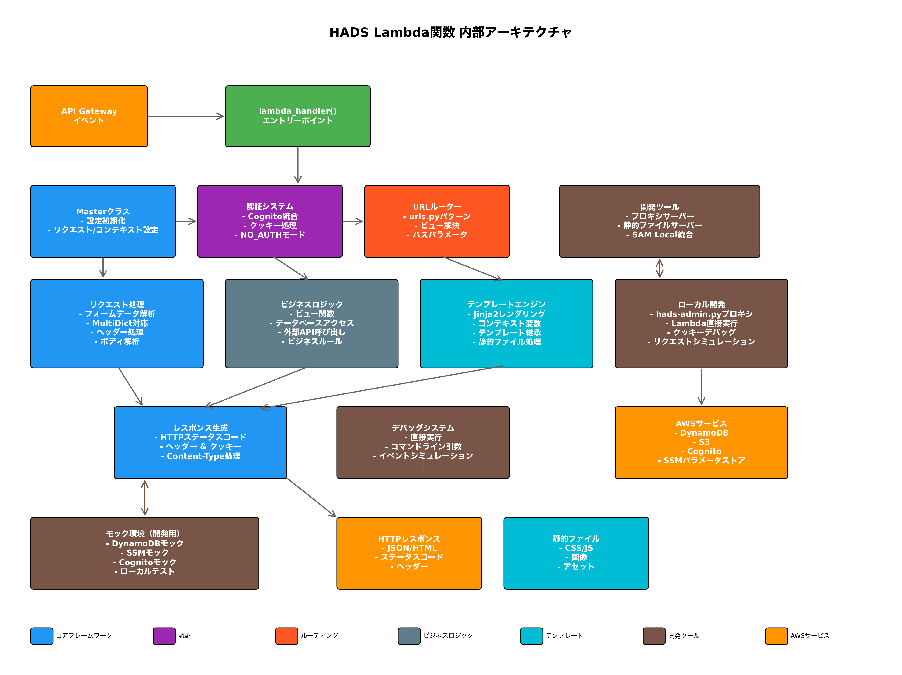

# 概要とフィロソフィー

## WAMBDAとは

WAMBDA は、AWS Lambda上で動作するサーバレスWebアプリケーションフレームワークです。DjangoライクなAPIを提供しながら、サーバレスアーキテクチャの利点を最大限に活用できるよう設計されています。

## フィロソフィー

WAMBDAは以下の5つの原則に基づいて設計されています：

### 1. 🏗️ Use SAM
AWS SAM（Serverless Application Model）を基盤として利用し、インフラストラクチャの管理を簡素化します。

### 2. ⚡ One Lambda (Lambdalithアプローチ)
アプリケーション全体を単一のLambda関数で動作させるLambdalithアプローチを採用し、コールドスタートの影響を最小限に抑えます。

### 3. 📁 Static files are distributed from S3
静的ファイルはS3から配信し、Lambda関数の負荷を軽減します。

### 4. 🧪 Test Locally
ローカル開発環境での動作確認を重視し、開発効率を向上させます。

### 5. 🐍 Like Django
Djangoに似たAPIを提供し、Webアプリケーション開発者にとって親しみやすいフレームワークを目指します。

## アーキテクチャ

### Lambdalithアプローチとは

WAMBDAは**Lambdalithアプローチ**と呼ばれる設計パターンを採用しています。これは、複数のマイクロサービスに分割せず、1つのLambda関数で全てのHTTPリクエストを処理するアプローチです。

#### Lambdalithアプローチの利点:
- **コールドスタートの最小化**: 1つのLambda関数のみのため、コールドスタート回数を削減
- **運用コストの削減**: 複数のLambda関数を管理する必要がなく、監視・ログ管理が簡単
- **開発効率の向上**: モノリシックな構造により、デバッグやテストが容易
- **関数間通信の不要**: 全てのロジックが同一Lambda内にあるため、関数間通信のオーバーヘッドなし

#### 適用場面:
- 中小規模のWebアプリケーション
- チーム規模が小さく、マイクロサービスの複雑性が不要な場合
- 開発スピードを重視するプロトタイプ開発

### システム構成

WAMBDAを使用したシステムの構成は以下の通りです：

```
┌─────────────────┐    ┌─────────────────┐    ┌─────────────────┐
│   CloudFront    │───▶│   API Gateway   │───▶│     Lambda      │
│                 │    │                 │    │                 │
└─────────────────┘    └─────────────────┘    └─────────────────┘
         │
         ▼
┌─────────────────┐
│       S3        │
│ (Static Files)  │
└─────────────────┘
```

- **Lambda**: アプリケーションロジックを実行
- **API Gateway**: HTTPリクエストを受け付けてLambdaに転送
- **S3**: 静的ファイル（CSS、JavaScript、画像など）を配信
- **CloudFront**: CDNとして静的ファイルの配信を高速化（オプション）

### Lambda内部構造

Lambda関数内部では、Djangoライクなアーキテクチャを採用しています：



## 他のフレームワークとの違い

### 従来のWebフレームワーク（Django、Flask等）との違い

| 項目 | 従来のフレームワーク | WAMBDA |
|------|---------------------|------|
| インフラ | サーバー管理が必要 | サーバレス（管理不要） |
| スケーリング | 手動設定が必要 | 自動スケーリング |
| コスト | 常時稼働コスト | 使用量に応じた課金 |
| デプロイ | 複雑な設定が必要 | SAMによる簡単デプロイ |
| 開発環境 | ローカルサーバー | SAM Localによるシミュレーション |

### HADの後継としての位置づけ

WAMBDAは[HAD](https://github.com/h-akira/had)の後継フレームワークですが、アーキテクチャは大きく異なります。
HADでは1能1Lambdaで多数のLambdawを作成し、SAMを用いずCloudFormationのみデプロイされていましたが、
WAMBDAではLambdalithアプローチでSAMを用います。これにより、コールドスタートの抑制やコードの単純化を実現しています。

## 適用分野

WAMBDAは以下のようなプロジェクトに適しています：

### ✅ 適している用途
- 中小規模のWebアプリケーション
- プロトタイプやMVPの開発
- 不定期アクセスのアプリケーション
- AWS環境での開発
- コスト効率を重視するプロジェクト

### ❌ 適していない用途
- 大量の同時アクセスが予想されるアプリケーション
- レスポンス時間が非常に重要なアプリケーション
- AWS以外のクラウド環境での運用
- 複雑なデータベース処理が中心のアプリケーション

## 次のステップ

WAMBDAの概要を理解したら、以下のページに進んでください：

- [インストールと初期設定](./installation.md) - WAMBDAをインストールして最初のプロジェクトを作成
- [クイックスタート](./quickstart.md) - 簡単なアプリケーションを作って動作を確認

---

[← ドキュメント目次に戻る](./README.md)
